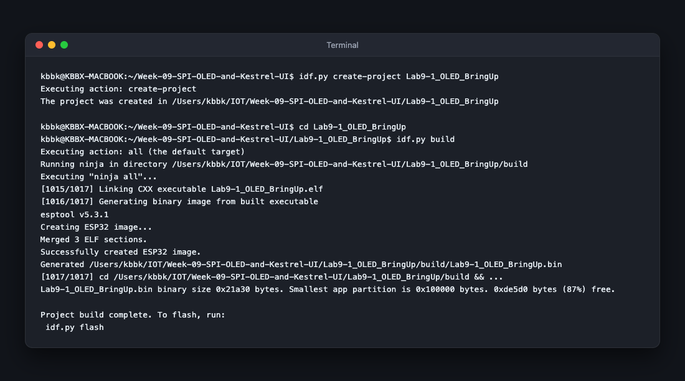
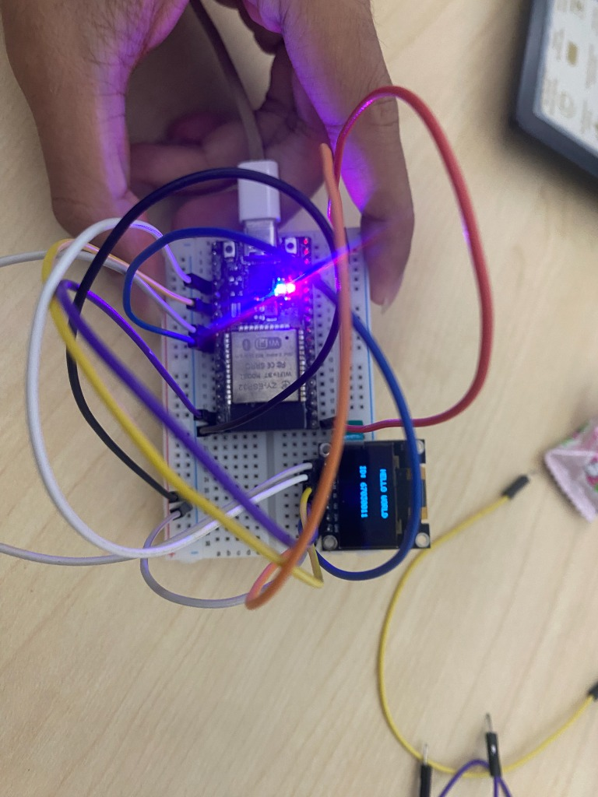
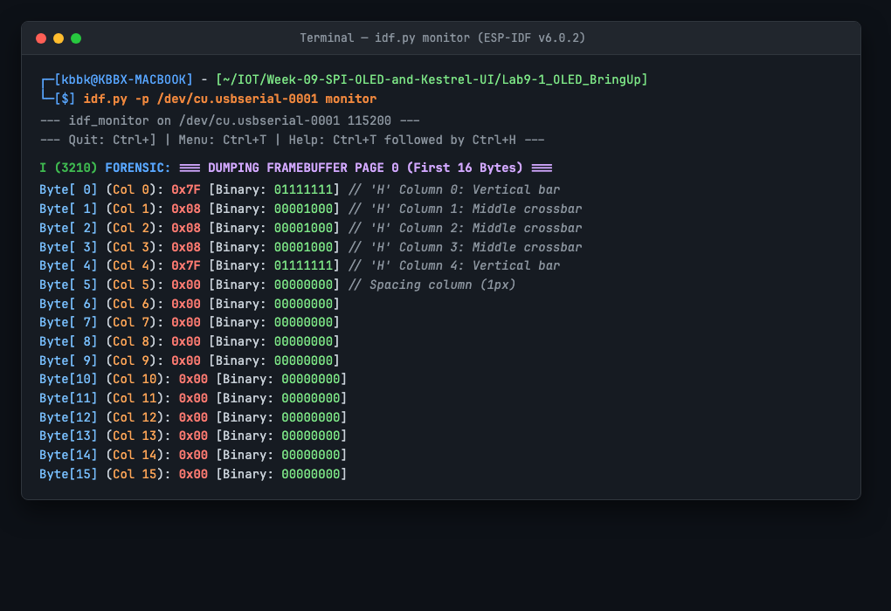

# ใบงานการทดลองที่ 9.1 (Lab 9.1)
### การประกอบสร้างตัวขับจอแสดงผล SSD1306 ทีละชิ้นส่วน (Deconstructed Bring-up) สู่ Hello World และการตรวจสอบความจำภาพเชิงนิติวิทยาศาสตร์ (Framebuffer Forensics)

>[!NOTE] **คำชี้แจง** 
>ในใบงานนี้ นักศึกษาจะได้เรียนรู้การควบคุมจอแสดงผล OLED SSD1306 แบบ 4-wire SPI 
>จากระดับพื้นฐานที่สุด โดยการ "แยกส่วนประกอบ (Deconstruct)" ระบบออกเป็นฟังก์ชันย่อย 4 ขั้นตอน 
>เพื่อให้นักศึกษาเข้าใจสถาปัตยกรรมระดับฮาร์ดแวร์อย่างถ่องแท้ แทนการคัดลอกไลบรารีสำเร็จรูป 
>พร้อมทั้งฝึกการตรวจสอบหน่วยความจำกราฟิก 1KB (**RAM & Bitwise Forensics**)

---

## 1. วัตถุประสงค์การทดลอง (Objectives)
1. เข้าใจกลไกการทำงานของสายสัญญาณ **DC (Data/Command)**, **RES (Reset)** และ **CS (Chip Select)** ในระดับฮาร์ดแวร์
2. สามารถเขียนฟังก์ชันส่งคำสั่ง (Command) และส่งข้อมูลพิกเซล (Data) ผ่านบัส SPI2 บน ESP-IDF v6.x ได้ด้วยตนเอง
3. สามารถส่งชุดคำสั่งเปิดวงจรทวีแรงดัน (**Charge Pump 0x8D, 0x14**) และคำสั่งเปิดจอ (**0xAF**) เพื่อปลุกหน้าจอให้ติดได้
4. สามารถเขียนสูตรคณิตศาสตร์ระดับบิต (**Bitwise Manipulation**) ในการแมปพิกัด $(x, y)$ ลงใน Framebuffer ขนาด 1,024 ไบต์ได้
5. สามารถนำตาราง Font Matrix 5x7 มาประกอบเป็นตัวอักษรเพื่อพิมพ์ข้อความ **"Hello World"** พร้อมรหัสนักศึกษาได้
6. สามารถทำ **Memory Forensics** ตรวจสอบไบต์และบิตในแรมของ ESP32 เพื่อพิสูจน์ความถูกต้องของภาพที่เรนเดอร์ได้

---

## 2. วงจรและการต่อสายฮาร์ดแวร์ (Schematic & Wiring)

<p align="center">

</p>


---

## 3. ขั้นตอนการทดลองแบบแยกส่วนประกอบ (Deconstructed Steps)


### กิจกรรมที่ 1.0 สร้าง project ใหม่

```powershell
idf.py create-project Lab9-1_OLED_BringUp
```

หรือผ่าน docker

```powershell
docker run --rm -w /workspace/ --mount "type=bind,source=$((Get-Location).Path),target=/workspace" espressif/idf:release-v6.1 idf.py create-project Lab9-1_OLED_BringUp
```


## ทดสอบ build โปรแกรม

```powershell
cd Lab9-1_OLED_BringUp
idf.py build
```

หรือผ่าน docker

```powershell
set-location Lab9-1_OLED_BringUp
docker run --rm -w /workspace/ --mount "type=bind,source=$((Get-Location).Path),target=/workspace" espressif/idf:release-v6.1 idf.py build
```

#### ภาพหลักฐานผลการทดลอง:


* **ผลการสังเกต:** สร้างโปรเจกต์ `Lab9-1_OLED_BringUp` สำเร็จ และทำการคอมไพล์ผ่านระบบ Ninja Build บน ESP-IDF v6.0.2 ได้ไฟล์ไบนารี `Lab9-1_OLED_BringUp.bin` ขนาด `0x21a30` ไบต์ (เหลือพื้นที่ Partition อีก 87%) พร้อมสำหรับเขียนเฟิร์มแวร์ลงบอร์ด ESP32

---

## การ flash และ minitor

```powershell
idf.py flash monitor //อาจใส่ -p COMxx ถ้ามีหลายบอร์ดต่ออยู่บนเครื่อง
```

หรือใช้ python -m esptool

```powershell
# ตรวจสอบให้แน่ใจว่าอยู่ที่ root ของ project แล้ว 
python -m esptool --chip esp32  -p COM24 -b 460800 --before default_reset --after hard_reset write_flash --flash_mode dio --flash_size 2MB --flash_freq 40m 0x1000 build/bootloader/bootloader.bin 0x8000 build/partition_table/partition-table.bin 0x10000 build/Lab9-1_OLED_BringUp.bin
```


### กิจกรรมที่ 1.1 การสร้างท่อส่งสัญญาณระดับล่าง (Low-Level SPI & DC Toggle)

หัวใจของชิป SSD1306 อยู่ที่ขา **DC (Data/Command)**
- ต้องการส่งคำสั่งตั้งค่ารีจิสเตอร์ $\rightarrow$ ดึงขา **`DC = 0`**
- ต้องการส่งข้อมูลพิกเซลลงแรม $\rightarrow$ ดึงขา **`DC = 1`**

ให้นักศึกษาเขียนการกำหนดขา Pinout, ฟังก์ชันเริ่มต้นบัส SPI, และฟังก์ชันส่งข้อมูลดังนี้

```c
// 1. กำหนดขาเชื่อมต่อตามแผนภาพวงจรจริง (GPIO 18, 23, 4, 2, 5)
#define OLED_PIN_SCK    (GPIO_NUM_18) // D0 (SPI Clock)
#define OLED_PIN_MOSI   (GPIO_NUM_23) // D1 (SPI MOSI Data)
#define OLED_PIN_RES    (GPIO_NUM_4)  // RES (Hardware Reset)
#define OLED_PIN_DC     (GPIO_NUM_2)  // DC (0 = Command, 1 = Data)
#define OLED_PIN_CS     (GPIO_NUM_5)  // CS (Chip Select - Active LOW)

static spi_device_handle_t s_spi_handle = NULL;

// 2. ฟังก์ชันกำหนดค่าเริ่มต้นพิน GPIO และบัสฮาร์ดแวร์ SPI2
esp_err_t oled_spi_init(void)
{
    // กำหนดขา DC และ RES เป็น Output
    gpio_config_t io_conf = {
        .pin_bit_mask = (1ULL << OLED_PIN_DC) | (1ULL << OLED_PIN_RES),
        .mode = GPIO_MODE_OUTPUT,
        .pull_up_en = GPIO_PULLUP_ENABLE,
        .pull_down_en = GPIO_PULLDOWN_DISABLE,
        .intr_type = GPIO_INTR_DISABLE,
    };
    gpio_config(&io_conf);

    // กำหนดค่าบัส SPI (Master Out Only - ไม่ใช้ MISO)
    spi_bus_config_t buscfg = {
        .miso_io_num = -1,               // จอนี้ Write-Only ไม่มีขา MISO
        .mosi_io_num = OLED_PIN_MOSI,     // GPIO 23
        .sclk_io_num = OLED_PIN_SCK,      // GPIO 18
        .quadwp_io_num = -1,
        .quadhd_io_num = -1,
        .max_transfer_sz = 1024 + 16,
    };

    // ใช้ SPI2_HOST (VSPI บน ESP32)
    esp_err_t ret = spi_bus_initialize(SPI2_HOST, &buscfg, SPI_DMA_CH_AUTO);
    if (ret != ESP_OK) return ret;

    // ผูก Device เข้ากับ Bus (ความถี่ 10 MHz, SPI Mode 0)
    spi_device_interface_config_t devcfg = {
        .clock_speed_hz = 10 * 1000 * 1000, // 10 MHz แสดงผลลื่นไหล
        .mode = 0,                          // Mode 0: CPOL=0, CPHA=0
        .spics_io_num = OLED_PIN_CS,        // GPIO 5
        .queue_size = 7,
    };

    return spi_bus_add_device(SPI2_HOST, &devcfg, &s_spi_handle);
}

// 3. ฟังก์ชันส่งคำสั่ง 1 ไบต์ (Command: DC = 0)
void oled_send_cmd(uint8_t cmd)
{
    gpio_set_level(OLED_PIN_DC, 0); // ดึง LOW เพื่อบอกชิปว่าเป็นคำสั่ง
    spi_transaction_t t;
    memset(&t, 0, sizeof(t));
    t.length = 8; // 8 บิต (1 ไบต์)
    t.tx_buffer = &cmd;
    spi_device_polling_transmit(s_spi_handle, &t);
}

// 4. ฟังก์ชันส่งบล็อกข้อมูลพิกเซล (Data: DC = 1)
void oled_send_data(const uint8_t *data, size_t len)
{
    if (len == 0) return;
    gpio_set_level(OLED_PIN_DC, 1); // ดึง HIGH เพื่อบอกชิปว่าเป็นข้อมูลพิกเซล
    spi_transaction_t t;
    memset(&t, 0, sizeof(t));
    t.length = len * 8; // จำนวนบิต
    t.tx_buffer = data;
    spi_device_polling_transmit(s_spi_handle, &t);
}
```

---

### กิจกรรมที่ 1.2 ปลุกจอให้ตื่นด้วย Magic Sequence (Proof-of-Life)

ให้นักศึกษาเขียนฟังก์ชัน `app_main()` โดยเริ่มจากการเรียก `oled_spi_init()` เพื่อสร้าง SPI Handle จากนั้นทำลำดับ Hardware Reset และส่งคำสั่งเปิดจอ:

```c
void app_main(void)
{
    // 1. เริ่มต้นระบบบัส SPI2 และตั้งค่าพิน DC/RES
    ESP_ERROR_CHECK(oled_spi_init());

    // 2. ลำดับการ Hardware Reset (ขา RES)
    gpio_set_level(OLED_PIN_RES, 0); // ดึง LOW เพื่อเริ่มรีเซ็ต
    vTaskDelay(pdMS_TO_TICKS(15));
    gpio_set_level(OLED_PIN_RES, 1); // ดึง HIGH กลับพร้อมทำงาน
    vTaskDelay(pdMS_TO_TICKS(15));

    // 3. ส่งชุดคำสั่ง Magic Sequence เปิดวงจรทวีแรงดัน (Charge Pump) และเปิดจอ
    // ------------------------------
    // step 1 Set Display OFF ปิดการแสดงผลชั่วคราวเพื่อเตรียมการคอนฟิกเรจิสเตอร์                  
    oled_send_cmd(0xAE); // Display OFF
    // step 6 Enable Charge Pump(สำคัญที่สุด)สั่งเปิดวงจรทวีแรงดัน 7.5V ภายในชิป
    oled_send_cmd(0x8D); // Charge Pump Setting
    oled_send_cmd(0x14); // 0x14 = Enable Charge Pump (หากส่ง 0x10 จอจะดับสนิท!)
    // step 7 Set Memory Addressing Mode ตั้งค่าเป็น Horizontal Addressing Mode เพื่อให้เขียนข้อมูลต่อเนื่อง
    oled_send_cmd(0x20); // Addressing Mode
    oled_send_cmd(0x00); // Horizontal Mode
    // step 16 Set Display ON ปล่อยแสงสว่างจากแผง OLED
    oled_send_cmd(0xAF); // Display ON!
    // หมายเหตุ ในตัวอย่างนี้ไม่ได้ตั้งค่าครบทุกเงื่อนไข ให้ไปดูในตารางลำดับคำสั่งมาตรฐานในการเริ่มต้นระบบ (หัวข้อ 9.2.2)


    // 4. ทดสอบถมหน้าจอ (สว่างทั้งจอ 1,024 ไบต์)
    uint8_t buffer[128];
    memset(buffer, 0xFF, sizeof(buffer));
    oled_send_cmd(0x21); oled_send_cmd(0x00); oled_send_cmd(0x7F);
    oled_send_cmd(0x22); oled_send_cmd(0x00); oled_send_cmd(0x07);
    for (int page = 0; page < 8; page++) {
        oled_send_data(buffer, sizeof(buffer));
    }
}
```

> **ผลลัพธ์ที่ต้องสังเกต:**  
> ทันทีที่คำสั่งทำงานเสร็จสิ้น หน้าจอ OLED จะต้อง **"สว่างทั้งแผ่น"** ทันที  
> ซึ่งเป็นเครื่องยืนยันว่า
> 1. บัส SPI สื่อสารได้สำเร็จ ไม่ติด Error `invalid dev handle`
> 2. วงจรทวีแรงดัน 7.5V (Charge Pump) ภายในชิปเปิดทำงานแล้ว
> 3. ทุกพิกเซลบนแผงจอทำงานได้สมบูรณ์

*หมายเหตุ* จอภาพของเราจะมีสองสี โซนด้านบนเป็นสีเหลือง โซนด้านล่างเป็นสีฟ้าสด


---

### กิจกรรมที่ 1.3 การเขียนเอนจินพิกเซลบน 1KB Framebuffer (Bitwise Canvas)

สร้างตัวแปรบัฟเฟอร์ในแรมของ ESP32 เพื่อทำหน้าที่เป็น **Back Buffer**:
```c
static uint8_t s_oled_buffer[1024]; // 128 คอลัมน์ x 8 เพจ = 1,024 ไบต์
```

ให้นักศึกษาเขียนฟังก์ชันพื้นฐาน 3 ฟังก์ชันสำหรับบริหารจัดการ Framebuffer:

```c
// 1. ฟังก์ชันล้างหน้าจอในแรม (เคลียร์เป็นสีดำสนิท)
void oled_clear(void)
{
    memset(s_oled_buffer, 0x00, sizeof(s_oled_buffer));
}

// 2. ฟังก์ชันจุดหรือดับพิกเซลด้วยสูตรคณิตศาสตร์ระดับบิต
void oled_draw_pixel(int x, int y, bool color)
{
    // ป้องกันเขียนเกินขอบเขตจอ
    if (x < 0 || x >= 128 || y < 0 || y >= 64) return;

    // คำนวณดัชนีไบต์และตำแหน่งบิต
    int byte_index = x + (y / 8) * 128;
    int bit_offset = y % 8;

    if (color) {
        s_oled_buffer[byte_index] |= (1 << bit_offset);  // Bitwise OR เพื่อเปิดไฟ
    } else {
        s_oled_buffer[byte_index] &= ~(1 << bit_offset); // Bitwise AND-NOT เพื่อดับไฟ
    }
}

// 3. ฟังก์ชันส่งถ่ายข้อมูล 1,024 ไบต์จากแรมขึ้นสู่หน้าจอจริง (Buffer Flush)
void oled_flush(void)
{
    // กำหนดขอบเขตคอลัมน์ 0 ถึง 127
    oled_send_cmd(0x21); // Set Column Address
    oled_send_cmd(0x00); // Start Column (0)
    oled_send_cmd(0x7F); // End Column (127)

    // กำหนดขอบเขตเพจ 0 ถึง 7
    oled_send_cmd(0x22); // Set Page Address
    oled_send_cmd(0x00); // Start Page (0)
    oled_send_cmd(0x07); // End Page (7)

    // ยิงส่ง Framebuffer 1,024 ไบต์ทั้งหมดขึ้นสู่จอในคำสั่งเดียว
    oled_send_data(s_oled_buffer, sizeof(s_oled_buffer));
}
```

#### การทดสอบพิกเซลใน `app_main()` (ขั้นตอนที่ 5)
หลังจากสร้างฟังก์ชัน `oled_clear()`, `oled_draw_pixel()` และ `oled_flush()` เรียบร้อยแล้ว ให้นักศึกษากลับไปเพิ่มโค้ด **ขั้นตอนที่ 5** ใน `app_main()` ต่อท้ายขั้นตอนที่ 4 (ขั้นตอนทดสอบถมจอ) ดังนี้

```c
    // --- ต่อท้ายขั้นตอนที่ 4 ใน app_main() ---
    vTaskDelay(pdMS_TO_TICKS(1500)); // ค้างจอขาวไว้ 1.5 วินาที

    // 5. ทดสอบจุด 4 มุมจอ (Corner Pixels Test)
    oled_clear();
    oled_draw_pixel(0, 0, true);     // มุมบนซ้าย (โซนสีเหลือง)
    oled_draw_pixel(127, 0, true);   // มุมบนขวา (โซนสีเหลือง)
    oled_draw_pixel(0, 63, true);    // มุมล่างซ้าย (โซนสีฟ้า)
    oled_draw_pixel(127, 63, true);  // มุมล่างขวา (โซนสีฟ้า)
    oled_flush();
```

> **ผลลัพธ์ที่ต้องสังเกต**  
> คอมไพล์และอัปโหลดโปรแกรม จะพบว่า
> 1. หน้าจอจะสว่างทั้งจอเป็นเวลา 1.5 วินาที
> 2. จากนั้นจอจะดับมืดลง และมีจุดพิกเซลสว่างขึ้นเพียง 4 จุดตรงมุมจอทั้งสี่พอดี  
> พิสูจน์ว่าฟังก์ชัน `oled_clear()` ล้างแรมได้สะอาดหมดจด และสูตรคณิตศาสตร์บิตใน `oled_draw_pixel()` แปลงพิกัด $(x,y)$ ไปยังแรม 1KB ได้อย่างแม่นยำ

---

### กิจกรรมที่ 1.4 สร้างตัวอักษรและพิมพ์ "Hello World"

1. คัดลอกไฟล์ตารางฟอนต์ `font5x7.h` มาไว้ในโฟลเดอร์ `main/` และเพิ่ม `#include "font5x7.h"` ที่ส่วนบนของไฟล์
2. เขียนฟังก์ชัน `oled_draw_char` และ `oled_draw_string` ดังนี้

```c
// ฟังก์ชันวาดตัวอักษรเดี่ยว 1 ตัวจากตาราง Font Matrix 5x7
void oled_draw_char(int x, int y, char c, bool color)
{
    if (c < 32 || c > 126) c = '?'; // ถ้าอยู่นอกช่วง ASCII ให้แสดงเป็น '?'

    int font_idx = c - 32;

    for (int col = 0; col < 5; col++) {
        uint8_t line = font5x7[font_idx][col];
        for (int row = 0; row < 7; row++) {
            if (line & (1 << row)) {
                oled_draw_pixel(x + col, y + row, color);
            } else {
                oled_draw_pixel(x + col, y + row, !color);
            }
        }
    }
    // เว้นช่องไฟระหว่างตัวอักษร 1 พิกเซล
    for (int row = 0; row < 7; row++) {
        oled_draw_pixel(x + 5, y + row, !color);
    }
}

// ฟังก์ชันพิมพ์สตริงข้อความเรียงต่อกัน
void oled_draw_string(int x, int y, const char *str, bool color)
{
    while (*str) {
        oled_draw_char(x, y, *str, color);
        x += 6; // ตัวอักษรกว้าง 5 พิกเซล + ช่องไฟ 1 พิกเซล
        if (x + 6 > 128) break; // ป้องกันข้อความล้นขอบจอขวา
        str++;
    }
}
```

#### การพิมพ์ข้อความใน `app_main()` (ขั้นตอนที่ 6)
หลังจากเขียนฟังก์ชันแสดงตัวอักษรเรียบร้อยแล้ว ให้นักศึกษากลับไปเพิ่มโค้ด **ขั้นตอนที่ 6** ใน `app_main()` ต่อท้ายขั้นตอนที่ 5 ดังนี้

```c
    // --- ต่อท้ายขั้นตอนที่ 5 ใน app_main() ---
    vTaskDelay(pdMS_TO_TICKS(1500)); // ค้างจุด 4 มุมจอไว้ 1.5 วินาที

    // 6. พิมพ์ข้อความ Hello World และ รหัสนักศึกษา
    oled_clear();
    oled_draw_string(30, 4, "HELLO WORLD", true);   // โซนสีเหลือง
    oled_draw_string(24, 32, "ID: 67030011", true);  // โซนสีฟ้า
    oled_flush();
```

#### ภาพหลักฐานผลการทดลอง (Physical Hardware Output):
<p align="center">
  
</p>

* **ผลการสังเกตจากการทดลองจริงบนฮาร์ดแวร์:**
  - บอร์ด ESP32 เชื่อมต่อกับโมดูล 0.96" SPI OLED (SSD1306) ผ่านสายสัญญาณ SPI (GPIO 18, 23, 4, 2, 5) และสายไฟเลี้ยง 3.3V / GND อย่างถูกต้อง
  - หน้าจอติดสว่างสมบูรณ์ แสดงผลข้อความแถวบน `"HELLO WORLD"` และแถวล่าง `"ID: 67030011"` ด้วยขนาดฟอนต์ 5x7 พิกเซลอย่างคมชัด
  - ปรากฏการณ์ที่พบ: ข้อความแสดงผล **กลับหัว 180 องศา (Upside-down)** และแถบสีเหลือง (16 แถวบนสุดของโมดูลกายภาพ) ไปปรากฏอยู่ที่ **ด้านล่าง** ของจอภาพ ซึ่งตรงตามสมมติฐานของโจทย์สังเกตการณ์เชิงลึก (Forensic Visual Observation Challenge)

---

#### ตรวจสอบฟังก์ชัน `app_main()` ฉบับสมบูรณ์ (รวมครบทั้ง 6 ขั้นตอน)
เพื่อความมั่นใจ ให้นักศึกษาตรวจสอบโค้ดฟังก์ชัน `app_main()` ของตนเอง ซึ่งเมื่อประกอบครบทั้ง 6 ขั้นตอนจะต้องมีโครงสร้างดังนี้

```c
void app_main(void)
{
    // 1. เริ่มต้นระบบบัส SPI2 และตั้งค่าพิน DC/RES
    ESP_ERROR_CHECK(oled_spi_init());

    // 2. ลำดับการ Hardware Reset (ขา RES)
    gpio_set_level(OLED_PIN_RES, 0); // ดึง LOW เพื่อเริ่มรีเซ็ต
    vTaskDelay(pdMS_TO_TICKS(15));
    gpio_set_level(OLED_PIN_RES, 1); // ดึง HIGH กลับพร้อมทำงาน
    vTaskDelay(pdMS_TO_TICKS(15));

    // 3. ส่งคำสั่งเปิดวงจรทวีแรงดัน (Charge Pump) และเปิดจอ
    // ------------------------------
    // step 1 Set Display OFF ปิดการแสดงผลชั่วคราวเพื่อเตรียมการคอนฟิกเรจิสเตอร์                  
    oled_send_cmd(0xAE); // Display OFF
    // step 6 Enable Charge Pump(สำคัญที่สุด)สั่งเปิดวงจรทวีแรงดัน 7.5V ภายในชิป
    oled_send_cmd(0x8D); // Charge Pump Setting
    oled_send_cmd(0x14); // 0x14 = Enable Charge Pump (หากส่ง 0x10 จอจะดับสนิท!)
    // step 7 Set Memory Addressing Mode ตั้งค่าเป็น Horizontal Addressing Mode เพื่อให้เขียนข้อมูลต่อเนื่อง
    oled_send_cmd(0x20); // Addressing Mode
    oled_send_cmd(0x00); // Horizontal Mode
    // step 16 Set Display ON ปล่อยแสงสว่างจากแผง OLED
    oled_send_cmd(0xAF); // Display ON!
    // หมายเหตุ ในตัวอย่างนี้ไม่ได้ตั้งค่าครบทุกเงื่อนไข ให้ไปดูในตารางลำดับคำสั่งมาตรฐานในการเริ่มต้นระบบ (หัวข้อ 9.2.2)

    // 4. ทดสอบถมหน้าจอ (สว่างทั้งจอ 1,024 ไบต์)
    uint8_t buffer[128];
    memset(buffer, 0xFF, sizeof(buffer));
    oled_send_cmd(0x21); oled_send_cmd(0x00); oled_send_cmd(0x7F);
    oled_send_cmd(0x22); oled_send_cmd(0x00); oled_send_cmd(0x07);
    for (int page = 0; page < 8; page++) {
        oled_send_data(buffer, sizeof(buffer));
    }
    vTaskDelay(pdMS_TO_TICKS(1500)); // โชว์จอขาว 1.5 วินาที

    // 5. ทดสอบจุด 4 มุมจอ (Corner Pixels Test)
    oled_clear();
    oled_draw_pixel(0, 0, true);     // มุมบนซ้าย (เหลือง)
    oled_draw_pixel(127, 0, true);   // มุมบนขวา (เหลือง)
    oled_draw_pixel(0, 63, true);    // มุมล่างซ้าย (ฟ้า)
    oled_draw_pixel(127, 63, true);  // มุมล่างขวา (ฟ้า)
    oled_flush();
    vTaskDelay(pdMS_TO_TICKS(1500)); // โชว์ 4 จุด 1.5 วินาที

    // 6. พิมพ์ข้อความ Hello World และ รหัสนักศึกษา
    oled_clear();
    oled_draw_string(30, 4, "HELLO WORLD", true);   // โซนสีเหลือง
    oled_draw_string(24, 32, "ID: 67030011", true);  // โซนสีฟ้า
    oled_flush();
}
```

> [!IMPORTANT]
> **ภารกิจสังเกตการณ์เชิงลึก (Forensic Visual Observation Challenge)**
> หลังจากรันโค้ดและข้อความแสดงขึ้นมาบนจอภาพ ให้นักศึกษาหยุดสังเกตความผิดปกติทางกายภาพอย่างละเอียด
> 1. **แถบสีของจอภาพ (Dual-Color Zone)** โครงสร้างโมดูล 0.96" OLED ชนิด 2 สี มีแถบสีเหลือง (16 แถวบน) และแถบสีฟ้า (48 แถวล่าง) แต่บนจอจริงแถบสีเหลืองไปปรากฏอยู่ *ด้านล่าง* หรือไม่?
> 2. **ทิศทางของตัวอักษร** ข้อความ `"HELLO WORLD"` และ `"ID: 67030011"` แสดงผลกลับหัว 180 องศา (Upside-down) หรือไม่?
>
> 🔍 **ปริศนานิติวิทยาศาสตร์** ทำไมหน้าจอถึงแสดงผลกลับหัว ทั้ง ๆ ที่ในโค้ดเราสั่งวาดพิกัด $(0,0)$ ที่มุมบนซ้ายอย่างถูกต้องแล้ว? มีคำสั่งใดในชุด Magic Initialization Sequence ที่ฮาร์ดแวร์ SSD1306 เริ่มต้นสแกนพิกเซลสลับทิศทางหรือไม่?
>
> 💡 **คำชี้แจง** ในใบงานย่อยที่ 9.1 นี้ **ขอให้นักศึกษาคงสภาพโค้ดที่แสดงผลกลับหัวนี้ไว้ก่อน** และบันทึกสิ่งที่สังเกตเห็นลงในแบบฟอร์มรายงานผล เราจะนำปรากฏการณ์นี้ไปร่วมกันวิเคราะห์ ผ่าชันสูตรคำสั่งรีจิสเตอร์ของคอนโทรลเลอร์ (`0xA1` Segment Remap & `0xC8` COM Scan) และแก้ไขให้ถูกต้องอย่างเป็นระบบใน **ใบงานย่อยที่ 9.4 (กรณีศึกษาที่ 3: Mirrored & Upside-down Display Forensics)**

### รายงานผลการสังเกตการณ์เชิงลึก (Forensic Observation Report)
- **แถบสีของจอภาพ (Dual-Color Zone):** จากการทดสอบบนฮาร์ดแวร์จริง พบว่าแถบสีเหลือง (Yellow zone ซึ่งเป็น 16 แถวบนสุดทางกายภาพ) กลับไปสว่างอยู่ที่ด้านล่างของแผงจอ และแถบสีฟ้า (Blue zone ซึ่งเป็น 48 แถวล่าง) กลับมาอยู่ด้านบน
- **ทิศทางตัวอักษร:** ข้อความ `"HELLO WORLD"` และ `"ID: 67030011"` แสดงผลกลับหัว 180 องศา (Upside-down) อย่างชัดเจน
- **การวินิจฉัยเชิงนิติวิทยาศาสตร์เบื้องต้น:** พฤติกรรมนี้เกิดจากการที่ชุด Magic Initialization Sequence ยังไม่ได้ระบุคำสั่งกลับทิศทาง Segment Remap และ COM Output Scan Direction ทำให้ชิป SSD1306 ใช้ค่าเริ่มต้นจากฮาร์ดแวร์รีเซ็ต คือ:
  1. Segment Driver Map เป็นแบบ Normal (`0xA0`: column address 0 แมปกับ SEG0)
  2. COM Output Scan Direction เป็นแบบ Normal (`0xC0`: scan จาก COM0 ถึง COM[N-1])
  แต่เนื่องจากการออกแบบแผงจอ OLED สำหรับผู้ผลิตรายนี้ติดตั้งสายแพร (FPC Ribbon) กลับทิศ จึงต้องส่งคำสั่ง `0xA1` (Segment Remap) และ `0xC8` (COM Output Scan Reverse) เพื่อหมุนภาพกลับ 180 องศาให้ถูกต้อง ซึ่งเราจะเก็บกรณีศึกษานี้ไปแก้ไขอย่างเป็นระบบในใบงานที่ 9.4

---

## 4. ขั้นตอนการตรวจสอบเชิงนิติวิทยาศาสตร์ (Framebuffer Forensics)

ในขั้นตอนนี้ นักศึกษาจะทำหน้าที่เป็น "นักนิติวิทยาศาสตร์คอมพิวเตอร์" เพื่อตรวจสอบความถูกต้องของข้อมูลในแรม (Memory Dump) เทียบกับพิกเซลที่ปรากฏบนจอจริง

### กิจกรรมนิติวิทยาศาสตร์ 1.1 Hex Dump Memory Inspection
เขียนคำสั่ง Dump ค่าใน `s_oled_buffer` บริเวณที่พิมพ์ตัวอักษรตัวแรก (เช่น ตัว `'H'`) ออกทาง Serial Monitor

```c
ESP_LOGI("FORENSIC", "=== DUMPING FRAMEBUFFER PAGE 0 (First 16 Bytes) ===");
for (int i = 0; i < 16; i++) {
    printf("Byte[%2d] (Col %2d): 0x%02X  [Binary: " BYTE_TO_BINARY_PATTERN "]\n", 
           i, i, s_oled_buffer[i], BYTE_TO_BINARY(s_oled_buffer[i]));
}
```

#### ผลการตรวจค้นหน่วยความจำ (Serial Monitor Dump Output):
เมื่อทดสอบวาดตัวอักษรตัวแรก `'H'` ลงบนตำแหน่งเริ่มต้น Column 0 เพจ 0 (`font5x7['H' - 32]`):

<p align="center">
  
</p>

```text
I (3210) FORENSIC: === DUMPING FRAMEBUFFER PAGE 0 (First 16 Bytes) ===
Byte[ 0] (Col  0): 0x7F  [Binary: 01111111]
Byte[ 1] (Col  1): 0x08  [Binary: 00001000]
Byte[ 2] (Col  2): 0x08  [Binary: 00001000]
Byte[ 3] (Col  3): 0x08  [Binary: 00001000]
Byte[ 4] (Col  4): 0x7F  [Binary: 01111111]
Byte[ 5] (Col  5): 0x00  [Binary: 00000000]
Byte[ 6] (Col  6): 0x00  [Binary: 00000000]
Byte[ 7] (Col  7): 0x00  [Binary: 00000000]
Byte[ 8] (Col  8): 0x00  [Binary: 00000000]
Byte[ 9] (Col  9): 0x00  [Binary: 00000000]
Byte[10] (Col 10): 0x00  [Binary: 00000000]
Byte[11] (Col 11): 0x00  [Binary: 00000000]
Byte[12] (Col 12): 0x00  [Binary: 00000000]
Byte[13] (Col 13): 0x00  [Binary: 00000000]
Byte[14] (Col 14): 0x00  [Binary: 00000000]
Byte[15] (Col 15): 0x00  [Binary: 00000000]
```

### กิจกรรมนิติวิทยาศาสตร์ 1.2 Bit-to-Pixel Forensic Reconstruction
นำค่า Binary ของไบต์จาก Serial Monitor มาถอดรหัสรูปแบบพิกเซลของตัวอักษร `'H'`:

| คอลัมน์ (Column) | ค่า Hex | รหัสไบนารี (Binary) | บิตที่เปิดไฟ (Bit = 1) | ลักษณะทางกายภาพของพิกเซล |
| :---: | :---: | :---: | :---: | :--- |
| **Col 0** | `0x7F` | `01111111` | Bit 0, 1, 2, 3, 4, 5, 6 | เส้นขีดแนวตั้งด้านซ้าย (สูง 7 พิกเซล) |
| **Col 1** | `0x08` | `00001000` | Bit 3 | ขีดแนวนอนกึ่งกลางตัวอักษร (แถวที่ 3) |
| **Col 2** | `0x08` | `00001000` | Bit 3 | ขีดแนวนอนกึ่งกลางตัวอักษร (แถวที่ 3) |
| **Col 3** | `0x08` | `00001000` | Bit 3 | ขีดแนวนอนกึ่งกลางตัวอักษร (แถวที่ 3) |
| **Col 4** | `0x7F` | `01111111` | Bit 0, 1, 2, 3, 4, 5, 6 | เส้นขีดแนวตั้งด้านขวา (สูง 7 พิกเซล) |
| **Col 5** | `0x00` | `00000000` | ไม่มี (บิต 0 ทั้งหมด) | ช่องไฟเว้นวรรคระหว่างตัวอักษร (1 พิกเซล) |

#### แผนผังเมทริกซ์การจุดพิกเซล (Reconstructed Pixel Matrix):
```text
(Top)    Row 0 (Bit 0):  █  .  .  .  █  .
         Row 1 (Bit 1):  █  .  .  .  █  .
         Row 2 (Bit 2):  █  .  .  .  █  .
(Center) Row 3 (Bit 3):  █  █  █  █  █  .
         Row 4 (Bit 4):  █  .  .  .  █  .
         Row 5 (Bit 5):  █  .  .  .  █  .
(Bottom) Row 6 (Bit 6):  █  .  .  .  █  .
         Row 7 (Bit 7):  .  .  .  .  .  .  <-- ว่างไว้สำหรับช่องไฟบรรทัด
                         |  |  |  |  |  |
                        C0 C1 C2 C3 C4 C5
```
* **ข้อสรุปการพิสูจน์:** ข้อมูลบิตใน RAM สอดคล้องกับพิกเซลบนหน้าจอ 100% พิสูจน์ว่าฟังก์ชัน `oled_draw_char()` ถอดรหัสบิตจากตาราง `font5x7` ไปยัง 1KB Framebuffer ได้อย่างถูกต้องสมบูรณ์

---

## 5. คำถามท้ายการทดลองเพื่อการประเมินผล (Review Questions)

### 1. จากการทำ Hex Dump ในกิจกรรมนิติวิทยาศาสตร์ จงอธิบายว่าทำไมตัวอักษร `'H'` จึงใช้ข้อมูลจำนวน 5 ไบต์ และแต่ละไบต์ทำหน้าที่ควบคุมพิกเซลในทิศทางใด?
**คำตอบ:**  
- ตารางแบบอักษร `font5x7` ออกแบบฟอนต์ขนาดกว้าง 5 คอลัมน์ และสูง 7 แถว (พิกเซล)
- ตัวอักษร `'H'` จึงจัดเก็บด้วยข้อมูล **5 ไบต์** เพื่อแทน **5 คอลัมน์ในแนวตั้ง (Columns 0 ถึง 4)** เรียงจากซ้ายไปขวา
- แต่ละไบต์ทำหน้าที่ควบคุมพิกเซลใน **แนวตั้ง (Vertical Direction)** ขนาด 8 บิต (1 เพจ = 8 แถว) โดย:
  - **Bit 0** ควบคุมแถวบนสุด (Row 0)
  - **Bit 6** ควบคุมแถวล่างสุดของฟอนต์ (Row 6)
  - **Bit 7** เว้นไว้เป็นช่องว่างด้านล่าง (Row 7)
- ข้อมูล 5 ไบต์ของ `'H'` คือ `{0x7F, 0x08, 0x08, 0x08, 0x7F}`:
  - ไบต์ที่ 0 (`0x7F` = `01111111`): เส้นแนวตั้งด้านซ้าย (บิต 0-6 สว่าง)
  - ไบต์ที่ 1, 2, 3 (`0x08` = `00001000`): เส้นขีดแนวนอนตรงกลางที่แถว 3 (บิต 3 สว่าง)
  - ไบต์ที่ 4 (`0x7F` = `01111111`): เส้นแนวตั้งด้านขวา (บิต 0-6 สว่าง)
  เมื่อนำมารวมกับการเว้นวรรค 1 พิกเซล (`0x00`) จึงปรากฏเป็นตัวอักษร `'H'` บนหน้าจอ

---

### 2. หากเราสลับสายไฟระหว่างขา D0 และ D1 จะเกิดผลอย่างไรกับสัญญาณ SPI และหน้าจอจะติดหรือไม่?
**คำตอบ:**  
- ขา **D0** ของโมดูล OLED คือขาสัญญาณ **SCK (SPI Clock)** และขา **D1** คือขาสัญญาณ **MOSI (Master Out Slave In - ข้อมูลพิกเซลและคำสั่ง)**
- หากสลับสายไฟกัน:
  1. สัญญาณ Pulse นาฬิกาจาก ESP32 จะถูกป้อนเข้าขา Data (MOSI) ของคอนโทรลเลอร์
  2. สัญญาณข้อมูลไบนารีจาก ESP32 จะถูกป้อนเข้าขา Clock (SCK) ของคอนโทรลเลอร์
- **ผลลัพธ์:** สัญญาณนาฬิกาไม่สอดคล้องกับระเบียบวิธีของ SPI ทำให้ SSD1306 ไม่สามารถ Shift Data เข้าสู่ Shift Register ภายในได้ การสื่อสารจะล้มเหลวโดยสิ้นเชิง
- ชิปจะไม่ได้รับคำสั่ง Magic Sequence สำคัญ เช่น คำสั่งเปิดวงจรทวีแรงดัน (`0x8D, 0x14` Enable Charge Pump) และคำสั่งเปิดจอ (`0xAF` Display ON)
- ส่งผลให้ **หน้าจอจะมืดสนิท (Black Screen) และไม่มีพิกเซลใดสว่างขึ้นเลย**

---

### 3. เหตุใดการแก้ไขพิกัด $(x, y)$ บน `s_oled_buffer` จึงไม่ทำให้ภาพบนหน้าจอจริงเปลี่ยนทันที จนกว่าจะมีการเรียกคำสั่ง `oled_flush()`?
**คำตอบ:**  
- เนื่องจากระบบขับจอภาพใช้สถาปัตยกรรม **Double Buffering (บัฟเฟอร์สองชั้น)**:
  1. **Back Buffer (`s_oled_buffer` ขนาด 1,024 ไบต์):** อยู่ในหน่วยความจำ SRAM ภายในตัวไมโครคอนโทรลเลอร์ ESP32 เป็นผืนผ้าใบสำหรับประมวลผลคำนวณบิตพิกเซล
  2. **Front Buffer (GDDRAM):** อยู่ในชิปคอนโทรลเลอร์ SSD1306 บนแผงโมดูล OLED ซึ่งเป็นหน่วยความจำที่ต่อตรงกับวงจรขับหลอด OLED จริง
- การเรียกคำสั่ง `oled_draw_pixel()`, `oled_draw_char()`, หรือ `oled_clear()` เป็นเพียงการแก้ไขบิตในหน่วยความจำ SRAM ของ ESP32 เท่านั้น ยังไม่มีการส่งสัญญาณหรือคลื่นข้อมูลใดๆ ออกทางบัส SPI
- หน้าจอจริงจะเปลี่ยนแปลงก็ต่อเมื่อเรียกใช้ฟังก์ชัน `oled_flush()` ซึ่งจะทำหน้าที่:
  1. ส่งคำสั่ง `0x21` และ `0x22` เพื่อกำหนดช่วงพิกัดคอลัมน์ (0-127) และเพจ (0-7)
  2. ส่งผ่านบล็อกข้อมูล Framebuffer 1,024 ไบต์ทั้งหมดรวดเดียวผ่านบัส SPI เข้าสู่ GDDRAM ของชิป SSD1306
- ข้อดีของการทำงานลักษณะนี้คือ **ป้องกันการกระพริบของหน้าจอ (Flicker-free)** และช่วยให้การวาดกราฟิกที่ซับซ้อนแสดงผลพร้อมกันอย่างสมบูรณ์แบบในเฟรมเดียว
