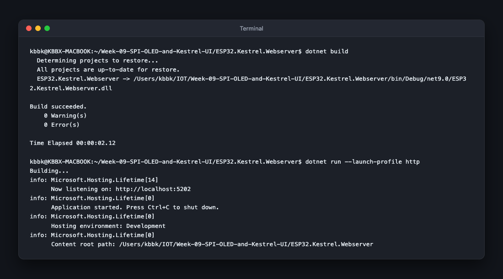
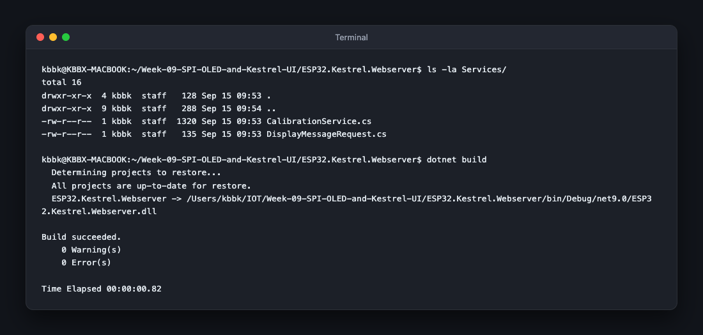
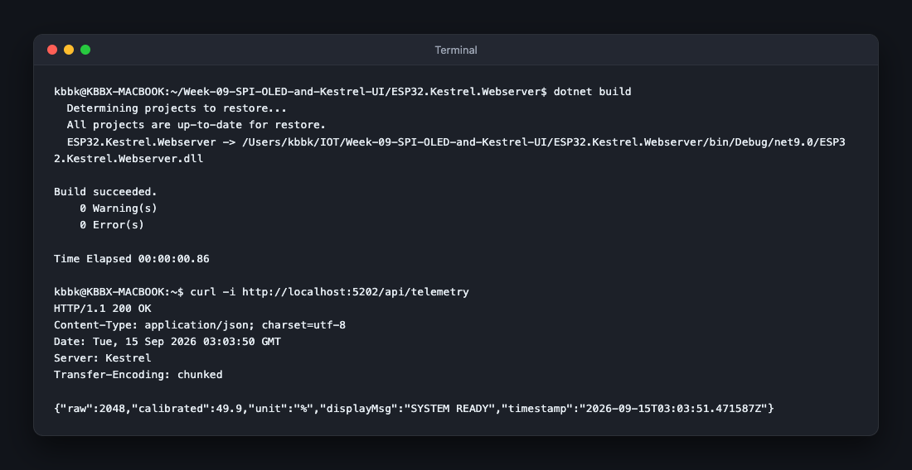
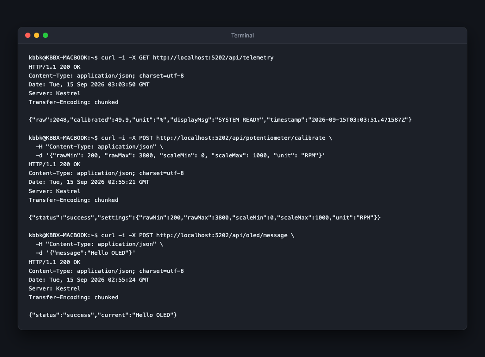
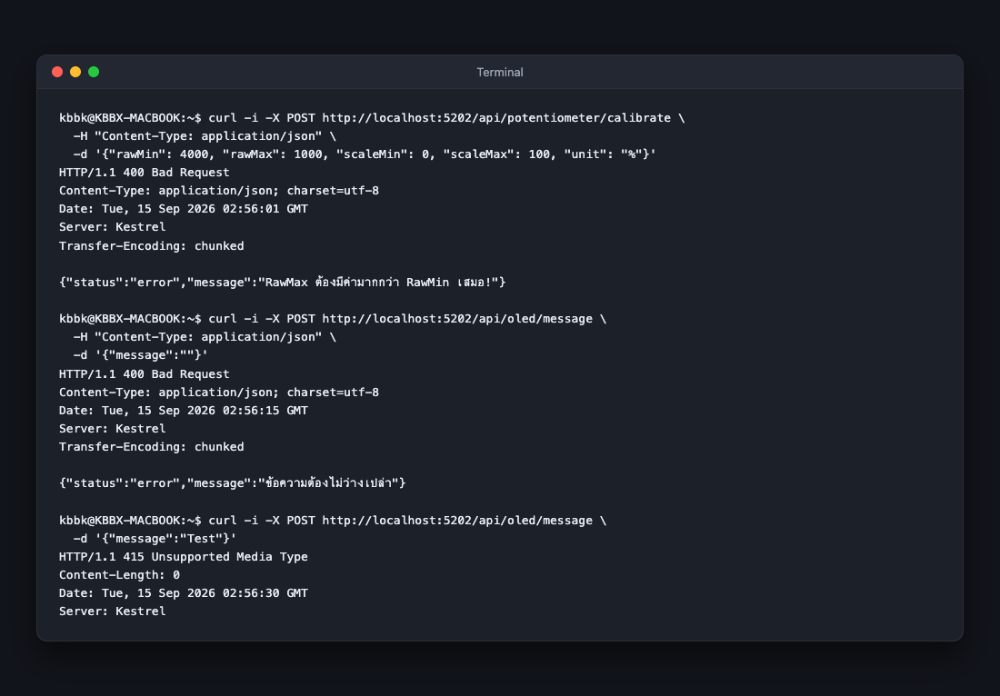

# ใบงานการทดลองที่ 9.2 (Lab 9.2)
### การพัฒนาเอนจินปรับเทียบเซนเซอร์และ API ควบคุมการแสดงผลบน Kestrel Web Server พร้อมการพิสูจน์หลักฐานเครือข่าย (HTTP Payload Forensics)

> **ข้อมูลผู้จัดทำ**
> * **รหัสนักศึกษา:** 67030011
> * **Git Branch:** `HW-67030011`
> * **โฟลเดอร์โปรเจกต์:** [ESP32.Kestrel.Webserver/](ESP32.Kestrel.Webserver/)

---

## 1. วัตถุประสงค์การทดลอง (Objectives)
1. เข้าใจหลักการและสามารถเขียนเอนจินคำนวณการปรับเทียบเซนเซอร์เชิงเส้นแบบสองจุด (**Two-Point Linear Calibration**) ในภาษา C# ได้
2. สามารถสร้าง Minimal API Endpoint สำหรับการรับพารามิเตอร์ Calibrate (`POST /api/potentiometer/calibrate`) ได้
3. สามารถสร้าง Endpoint สำหรับส่งข้อความสั่งการหน้าจอ OLED (`POST /api/oled/message`) ได้
4. สามารถตรวจสอบและตรวจพิสูจน์หลักฐานแพ็กเก็ตเครือข่าย (**HTTP Request/Response Forensics**) ผ่าน `curl` หรือ Browser DevTools ได้
5. เข้าใจและป้องกันข้อผิดพลาดทางคณิตศาสตร์ (เช่น การหารด้วยศูนย์ Divide-by-Zero และ Out-of-Bounds Clamping) ในบริการ IoT

---

## 2. โครงสร้าง REST Minimal API ที่สร้างขึ้น

```
[ Kestrel Web Server (Port 5202 / 5000) ]
  ├── GET  /api/telemetry                : สตรีมค่า Raw ADC, Calibrated Value, และข้อความสถานะปัจจุบัน
  ├── POST /api/potentiometer/calibrate  : ปรับเทียบค่าศูนย์และค่าเต็มสเกล (Zero & Span Calibration)
  └── POST /api/oled/message             : สั่งส่งข้อความ Broadcast ไปยังหน้าจอ OLED ทางกายภาพ
```

---

## 3. ขั้นตอนการทดลองและบันทึกผล (Step-by-Step Activities)

### กิจกรรมที่ 2.0: สร้างโปรเจกต์ Kestrel web server

1. สร้างโปรเจกต์ Minimal API ด้วย .NET SDK 9.0:
   ```bash
   dotnet new web -n ESP32.Kestrel.Webserver -f net9.0
   cd ESP32.Kestrel.Webserver
   ```
2. ทดสอบสั่ง `dotnet build` และ `dotnet run --launch-profile http`

#### ภาพหลักฐานผลการทดลอง:


* **ผลการสังเกต:** การคอมไพล์ผ่านฉลุย `0 Warning(s), 0 Error(s)` ตัว Kestrel Web Server เริ่มทำงานและเปิด Listening ที่ URL `http://localhost:5202`

---

### กิจกรรมที่ 2.1: การสร้างโมเดลและบริการปรับเทียบ (Calibration Service)

1. สร้างโฟลเดอร์ `Services/` ภายในโปรเจกต์
2. สร้างไฟล์ `Services/CalibrationService.cs` บรรจุคลาส `CalibrationSettings` และ `CalibrationService`
3. สร้างไฟล์ `Services/DisplayMessageRequest.cs` บรรจุ DTO รับข้อความ

#### ภาพหลักฐานผลการทดลอง:


* **ผลการสังเกต:** ไฟล์ `CalibrationService.cs` และ `DisplayMessageRequest.cs` ถูกสร้างขึ้นอย่างถูกต้องในโฟลเดอร์ `Services/` และเมื่อสั่ง `dotnet build` ระบบคอมไพล์ผ่านสมบูรณ์

---

### กิจกรรมที่ 2.2: การผูก Minimal API Routes (Program.cs)

ทำการลงทะเบียน `CalibrationService` เป็น Singleton และผูก Route ทั้ง 3 รูปแบบใน `Program.cs`:
- `GET /api/telemetry` : อ่านข้อมูลค่าเซนเซอร์ดิบและค่าที่ปรับเทียบแล้ว
- `POST /api/potentiometer/calibrate` : อัปเดตพารามิเตอร์การปรับเทียบ
- `POST /api/oled/message` : ส่งข้อความแจ้งเตือนขึ้นหน้าจอ OLED

#### ภาพหลักฐานผลการทดลอง:


* **ผลการสังเกต:** การผูก Route Minimal API เสร็จสมบูรณ์ คอมไพล์ `dotnet build` ผ่านฉลุย 0 Error(s) และเมื่อยิงทดสอบ `curl -i http://localhost:5202/api/telemetry` ได้รับสถานะ `HTTP/1.1 200 OK` พร้อม Response Header `Server: Kestrel` และก้อน JSON Telemetry ทันที

---

## 4. ขั้นตอนการตรวจสอบเชิงนิติวิทยาศาสตร์ (HTTP Payload Forensics)

### กิจกรรมนิติวิทยาศาสตร์ 2.1: ทดสอบเรียกใช้งาน API ครบทั้ง 3 รูปแบบ

ทดสอบยิง Request ผ่านคำสั่ง `curl -i` เพื่อดึง Raw HTTP Response Headers ออกมาวิเคราะห์:

#### 1. ตรวจสอบ Telemetry ปัจจุบัน (HTTP GET):
```bash
curl -i -X GET http://localhost:5202/api/telemetry
```
* **Raw Response ที่ตรวจพบ:**
  ```http
  HTTP/1.1 200 OK
  Content-Type: application/json; charset=utf-8
  Date: Tue, 15 Sep 2026 03:03:50 GMT
  Server: Kestrel
  Transfer-Encoding: chunked

  {"raw":2048,"calibrated":49.9,"unit":"%","displayMsg":"SYSTEM READY","timestamp":"2026-09-15T03:03:51.471587Z"}
  ```

#### 2. ทำการ Calibrate เซนเซอร์ใหม่ (HTTP POST พร้อม JSON Body):
```bash
curl -i -X POST http://localhost:5202/api/potentiometer/calibrate \
  -H "Content-Type: application/json" \
  -d '{"rawMin": 200, "rawMax": 3800, "scaleMin": 0, "scaleMax": 1000, "unit": "RPM"}'
```
* **Raw Response ที่ตรวจพบ:**
  ```http
  HTTP/1.1 200 OK
  Content-Type: application/json; charset=utf-8
  Date: Tue, 15 Sep 2026 02:55:21 GMT
  Server: Kestrel
  Transfer-Encoding: chunked

  {"status":"success","settings":{"rawMin":200,"rawMax":3800,"scaleMin":0,"scaleMax":1000,"unit":"RPM"}}
  ```

#### 3. ส่งข้อความใหม่ไปแสดงบนหน้าจอ OLED (HTTP POST):
```bash
curl -i -X POST http://localhost:5202/api/oled/message \
  -H "Content-Type: application/json" \
  -d '{"message":"Hello OLED"}'
```
* **Raw Response ที่ตรวจพบ:**
  ```http
  HTTP/1.1 200 OK
  Content-Type: application/json; charset=utf-8
  Date: Tue, 15 Sep 2026 02:55:24 GMT
  Server: Kestrel
  Transfer-Encoding: chunked

  {"status":"success","current":"Hello OLED"}
  ```

#### ภาพหลักฐานผลการทดลอง:


---

### กิจกรรมนิติวิทยาศาสตร์ 2.2: Fault Injection & Vulnerability Probe (การจงใจฉีดข้อมูลวิกฤต)

#### 1. ทดสอบป้อนค่าสเกลผิดตรรกะ (Span Point น้อยกว่า Zero Point / RawMax <= RawMin):
```bash
curl -i -X POST http://localhost:5202/api/potentiometer/calibrate \
  -H "Content-Type: application/json" \
  -d '{"rawMin": 4000, "rawMax": 1000, "scaleMin": 0, "scaleMax": 100, "unit": "%"}'
```
* **ผลลัพธ์:** เซิร์ฟเวอร์ตอบกลับ `HTTP/1.1 400 Bad Request` พร้อม JSON:
  ```json
  {"status":"error","message":"RawMax ต้องมีค่ามากกว่า RawMin เสมอ!"}
  ```
  ระบบดักจับข้อผิดพลาดได้ปลอดภัย ตัว Kestrel Server **ไม่แครช (No Server Crash)**

#### 2. ทดสอบส่งข้อความว่างเปล่า:
```bash
curl -i -X POST http://localhost:5202/api/oled/message \
  -H "Content-Type: application/json" \
  -d '{"message":""}'
```
* **ผลลัพธ์:** ได้รับ `HTTP/1.1 400 Bad Request` พร้อมข้อความแจ้งเตือน `{"status":"error","message":"ข้อความต้องไม่ว่างเปล่า"}`

#### 3. ทดสอบละเว้น Header Content-Type:
```bash
curl -i -X POST http://localhost:5202/api/oled/message \
  -d '{"message":"Test"}'
```
* **ผลลัพธ์:** ได้รับ `HTTP/1.1 415 Unsupported Media Type` เนื่องจาก Kestrel ปฏิเสธ Request ที่ไม่ระบุ Media Type

#### ภาพหลักฐานผลการทดลอง:


---

## 5. คำถามท้ายการทดลองเพื่อการประเมินผล (Review Questions & Answers)

### 1. เหตุใดการคำนวณสเกลเซนเซอร์จึงควรทำที่ฝั่ง Kestrel Server แทนที่จะคำนวณบนไมโครคอนโทรลเลอร์ ESP32 ตั้งแต่แรก?
* **คำตอบ:**
  1. **Decoupling of Hardware and Business Logic (การแยกบทบาทหน้าที่):** หน้าที่หลักของไมโครคอนโทรลเลอร์คือการเป็น Edge Transducer สุ่มอ่านสัญญาณแรงดันแอนะล็อกดิบ (Raw ADC 0–4095) ให้แม่นยำและรวดเร็วที่สุด การนำสูตรสเกลไปฝังไว้ในไมโครคอนโทรลเลอร์ทำให้เมื่อมีการเปลี่ยนประเภทเซนเซอร์, เปลี่ยนหน่วยวัด (เช่น จาก % เป็น RPM), หรือเซนเซอร์เกิดการเบี่ยงเบน (Sensor Drift) จะต้องทำการ Re-compile และ Flash เฟิร์มแวร์ใหม่ทุกครั้ง ซึ่งทำได้ยากเมื่อติดตั้งอุปกรณ์ในพื้นที่จริง
  2. **Dynamic Runtime Calibration (การปรับเทียบแบบรวมศูนย์):** การประมวลผลบน Kestrel Server ช่วยให้ผู้ควบคุมสามารถเปลี่ยนพารามิเตอร์ Zero/Span ผ่านหน้าเว็บหรือ REST API ได้ทันทีแบบ Real-time โดยไม่ต้องหยุดการทำงานของฮาร์ดแวร์
  3. **Conservation of Edge Resources (การประหยัดทรัพยากรไมโครคอนโทรลเลอร์):** การคำนวณเลขทศนิยม (Floating Point Arithmetic) มีต้นทุนของ CPU Cycles และพลังงาน การส่งเฉพาะเลขจำนวนเต็ม 12-bit (Raw ADC) ช่วยลดภาระและประหยัดพลังงานของ ESP32 ได้อย่างมาก

---

### 2. จากการทำ HTTP Forensics หากไม่มีการตรวจสอบเงื่อนไข `RawMax <= RawMin` ในโค้ด จะเกิด Exception ชนิดใดขึ้นในภาษา C# และส่งผลต่อการทำงานของเซิร์ฟเวอร์อย่างไร?
* **คำตอบ:**
  1. **ชนิดของ Exception และผลการคำนวณ:** หากไม่มีการตรวจสอบเงื่อนไข `RawMax <= RawMin` ในฟังก์ชัน `UpdateSettings()` เมื่อผู้ใช้ป้อนค่า `RawMax == RawMin` ในฟังก์ชัน `Compute()` จะเกิดการหารด้วยศูนย์:
     $$\frac{\text{clamped} - \text{RawMin}}{\text{RawMax} - \text{RawMin}} \rightarrow \frac{\dots}{0}$$
     เนื่องจากใน C# ตัวแปรถูก Cast เป็นชนิด `double` ผลลัพธ์ทางคณิตศาสตร์จะกลายเป็น `double.NaN` (Not a Number) หรือ `double.PositiveInfinity` ซึ่งเมื่อส่งต่อไปยังขั้นตอน JSON Serialization จะเกิดข้อผิดพลาดในการแปลงข้อมูล หรือหากสูตรใช้ชนิดข้อมูลจำนวนเต็ม (Integer) จะทำให้เกิด **`DivideByZeroException`** ทันที
  2. **กรณี `RawMax < RawMin`:** ค่าความชันของสมการเส้นตรงจะติดลบ ทำให้สเกลกลับทิศทาง (Inverted Scale) ส่งผลให้ข้อมูลที่แสดงผลผิดเพี้ยนจากความเป็นจริง
  3. **ผลกระทบต่อเซิร์ฟเวอร์:** หากปล่อยให้เกิด Unhandled Exception ตัว Kestrel Server จะตอบกลับไคลเอนต์ด้วยรหัส **`500 Internal Server Error`** ซึ่งแสดงถึงความไม่เสถียรของระบบ การดักจับด้วย `ArgumentException` แล้วตอบกลับด้วย **`400 Bad Request`** จึงเป็นการป้องกันระบบตามหลักการ Fail-Safe และ Robust API Design

---

### 3. อธิบายสาเหตุทางเทคนิคว่าทำไมคำขอ HTTP POST ที่ไม่มี Header `Content-Type: application/json` จึงถูกปฏิเสธด้วยรหัสสถานะ `415 Unsupported Media Type`?
* **คำตอบ:**
  1. **มาตรฐาน Content Negotiation (RFC 9110):** ส่วนหัว `Content-Type` เป็นสิ่งจำเป็นที่ใช้ระบุว่าข้อมูล Payload ใน Body ของ HTTP Request ถูกเข้ารหัสด้วย MIME Type รูปแบบใด
  2. **กลไก Input Formatter ของ ASP.NET Core Kestrel:** ใน Minimal API เมธอด `app.MapPost` มีการผูกพารามิเตอร์เป็น Class Object (`DisplayMessageRequest req` หรือ `CalibrationSettings newSettings`) ตัว Kestrel ต้องอาศัย `System.Text.Json` Input Formatter ในการแปลง JSON Payload มาเป็น C# Object
  3. **การปฏิเสธคำขอ:** หาก Client ละเว้นการส่ง Header `Content-Type` หรือระบุเป็นชนิดอื่น Kestrel จะไม่สามารถเลือก Input Formatter ที่ถูกต้องสำหรับ Deserialization ได้ จึงทำการปฏิเสธคำขอตั้งแต่ระดับ Middleware ด้วยรหัส **`415 Unsupported Media Type`** เพื่อป้องกันข้อผิดพลาดจากการตีความรูปแบบข้อมูลที่ไม่ตรงกัน
