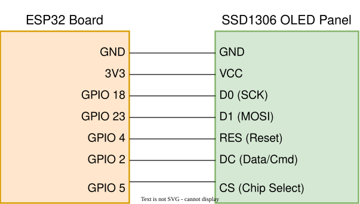
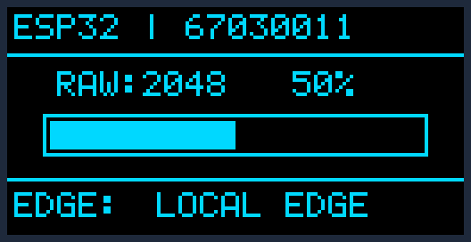
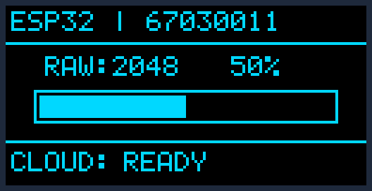
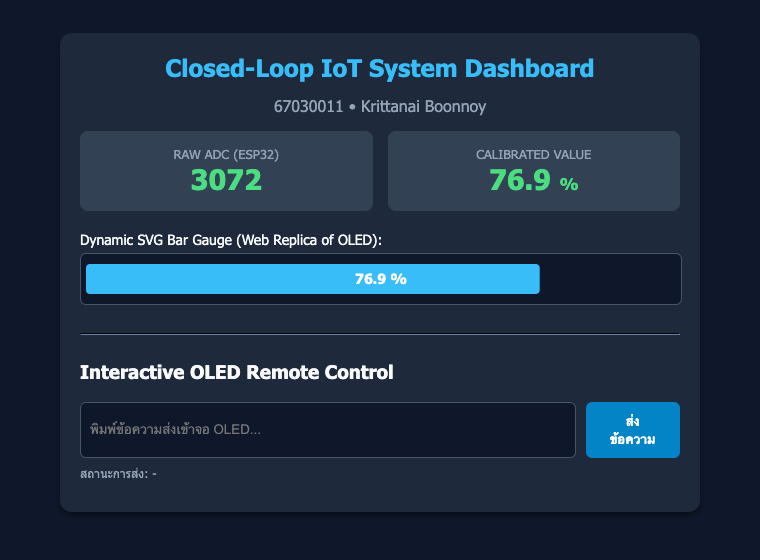
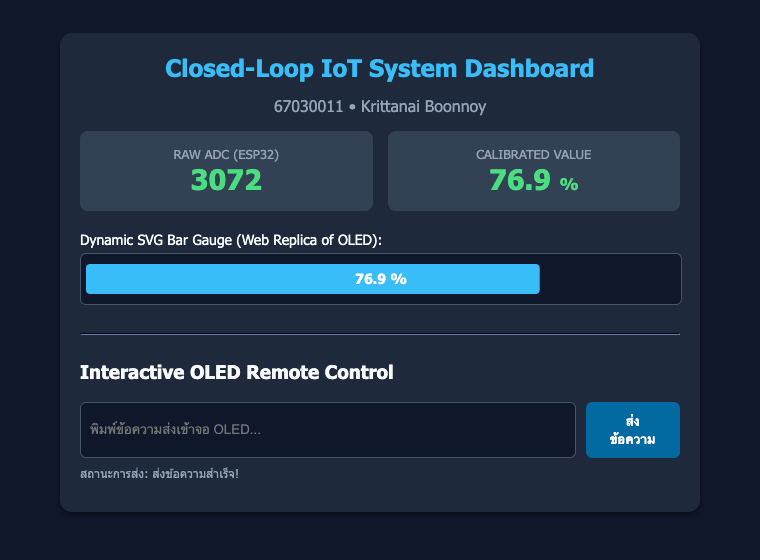
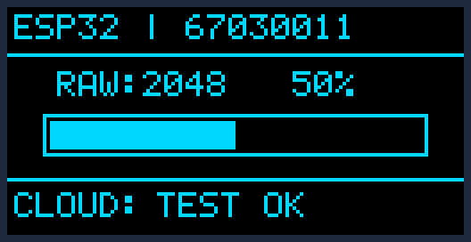
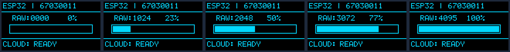

# ใบงานการทดลองที่ 9.3 (Lab 9.3)
### การรวมระบบวงปิดแบบครบวงจร การตรวจสอบความสอดคล้องของข้อมูลและเวลาหน่วง (End-to-End Closed-Loop IoT, Co-Verification & Latency Forensics)

>[!NOTE] **คำชี้แจง**
>ในใบงานนี้นักศึกษาจะได้นำชิ้นส่วนความรู้ทั้งหมดจาก Lab 9.1 (ตัวขับจอแสดงผล SPI OLED ระดับล่าง) และ Lab 9.2 (เว็บเซิร์ฟเวอร์ Kestrel และเอนจินการปรับเทียบเซนเซอร์) มารวมกันเป็น **ระบบ IoT วงปิดแบบสมบูรณ์ (Full-Duplex Closed-Loop IoT System)**
>**Potentiometer $\rightarrow$ ESP32 ADC1 $\rightarrow$ Kestrel Server (.NET 8/10) $\rightarrow$ หน้าจอ OLED ทางกายภาพ + เว็บแดชบอร์ด SVG**
>
>พร้อมทั้งฝึกกระบวนการตรวจพิสูจน์ความสอดคล้องของข้อมูลข้ามระบบ (**Co-Verification**) และตรวจวัดความหน่วงเวลา (**End-to-End Latency Forensics**) เพื่อพิสูจน์ว่าระบบตอบสนองตามเกณฑ์มาตรฐาน Real-Time ทางอุตสาหกรรมหรือไม่

---

## 1. วัตถุประสงค์การทดลอง (Objectives)
1. สามารถต่อวงจรร่วมระหว่าง Potentiometer (ADC1 GPIO 34) และจอ OLED SSD1306 (บัสฮาร์ดแวร์ SPI2) บน ESP32 บอร์ดเดียวกันได้อย่างถูกต้องและมีเสถียรภาพสัญญาณสูง
2. สามารถเขียนเฟิร์มแวร์ ESP-IDF จัดการแสดงผลหน้าจอแบบ **Multi-Zone Layout** (Header Status, Dynamic Bar Gauge, Footer Mode) บน Framebuffer 1KB ได้
3. สามารถพัฒนาระบบสื่อสารแบบสองทิศทาง (**Full-Duplex Serial Stream**) รับส่งข้อมูลระหว่าง ESP32 และ Background Service บน Kestrel Web Server ได้
4. สามารถออกแบบกลไกสลับโหมดการประมวลผลอัตโนมัติ (**Hybrid Edge-Cloud Fallback**) ทำงานแบบ Edge Computing เมื่อตัดการเชื่อมต่อ และยกระดับเป็น Cloud Computing เมื่อเชื่อมต่อเซิร์ฟเวอร์สำเร็จ
5. สามารถทำการตรวจสอบความสอดคล้องของข้อมูล (**Co-Verification**) ระหว่างจอ OLED จริงและ SVG Web Dashboard ได้อย่างเป็นระบบ
6. สามารถตรวจวัด บันทึก และวิเคราะห์ความหน่วงเวลาของระบบ (**End-to-End Latency Forensics**) เพื่อหาจุดคอขวด (Bottleneck) ของการสื่อสาร

---

## 2. แผนผังระบบและสถาปัตยกรรมฮาร์ดแวร์ (System Architecture & Hardware Wiring)

### 2.1 บล็อกไดอะแกรมระบบวงปิด (Closed-Loop System Flow)

<p align="center">

</p>

> [!IMPORTANT]
> **ทำไมต้องต่อ Potentiometer ที่ ADC1 (GPIO 34)?**  
> ชิป ESP32 มีวงจร ADC 2 ชุด คือ **ADC1** (GPIO 32-39) และ **ADC2** (GPIO 0, 2, 4, 12-15, 25-27)  
> ในระบบ IoT ที่ต้องเปิดใช้งาน Wi-Fi หรือ Bluetooth วงจร **ADC2 จะถูกฮาร์ดแวร์ภายในของโมดูล Wi-Fi จองใช้งานแบบผูกขาด** หากโปรแกรมพยายามอ่านค่าจาก ADC2 ขณะเปิด Wi-Fi จะเกิดค่าเพี้ยนหรือระบบค้างทันที ดังนั้นการต่อเซนเซอร์แอนะล็อกในงาน IoT **ต้องใช้ขาของ ADC1 เท่านั้น**

---

### 2.2 การเชื่อมต่อวงจรฮาร์ดแวร์ (Hardware Wiring)

<p align="center">

</p>

ให้นักศึกษาต่อสายวงจรระหว่างบอร์ด ESP32, หน้าจอ OLED SSD1306 (SPI), และ Potentiometer ตามตารางต่อไปนี้

| อุปกรณ์ภายนอก      | ขาสัญญาณบนโมดูล | ขาเชื่อมต่อบน ESP32 | คำอธิบายทางเทคนิค                     |
| :----------------- | :-------------- | :------------------ | :------------------------------------ |
| **OLED (SSD1306)** | GND             | GND                 | กราวด์ร่วมของระบบ                     |
|                    | VCC             | 3.3V                | แหล่งจ่ายไฟบวก (ห้ามต่อ 5V)           |
|                    | D0 / SCL        | **GPIO 18**         | SPI2 Hardware Clock (SCK)             |
|                    | D1 / SDA        | **GPIO 23**         | SPI2 Master Out Slave In (MOSI)       |
|                    | RES             | **GPIO 4**          | Hardware Reset (Active LOW)           |
|                    | DC              | **GPIO 2**          | Data / Command Select (0=Cmd, 1=Data) |
|                    | CS              | **GPIO 5**          | SPI Chip Select (Active LOW)          |
| **Potentiometer**  | ขา 1 (ริม)      | GND                 | กราวด์อ้างอิง                         |
|                    | ขา 2 (กลาง)     | **GPIO 34**         | สัญญาณแอนะล็อก (ADC1 Channel 6)       |
|                    | ขา 3 (ริม)      | 3.3V                | แรงดันอ้างอิงสูงสุด                   |

---

### 2.3 การออกแบบสัดส่วนหน้าจอ (Multi-Zone Layout)

เพื่อให้นักศึกษาเข้าใจสถาปัตยกรรมการจัดสรรพื้นที่บนหน้าจอความละเอียดจำกัด ($128 \times 64$ พิกเซล) เราจะแบ่ง Framebuffer 1KB ออกเป็น 3 โซนอิสระ:

<p align="center">

</p>

```
พิกัด Y
Y = 0  ┌────────────────────────────────────────────────────────┐
       │ Zone 1: Status Header (สูง 13 พิกเซล)                    │
       │ - แสดงชื่อโหนด, รหัสนักศึกษา, สถานะการเชื่อมต่อ                 │
Y = 13 ├────────────────────────────────────────────────────────┤ ◄── เส้นแบ่งแนวนอน (Line H)
       │ Zone 2: Telemetry Bar Gauge (สูง 35 พิกเซล)              │
       │ - กรอบ Gauge Box (108x12 พิกเซล) พร้อมแถบถมตาม %         │
       │ - ค่าตัวเลขดิบ (RAW) และค่าสเกลเปอร์เซ็นต์ (CAL)                │
Y = 48 ├────────────────────────────────────────────────────────┤ ◄── เส้นแบ่งแนวนอน (Line H)
       │ Zone 3: Mode & Footer (สูง 15 พิกเซล)                    │
       │ - แสดงโหมด: "EDGE COMPUTING" หรือ "CLOUD COMPUTING"     │
       │ - แสดงข้อความแจ้งเตือนที่ Kestrel ส่งกลับมา                    │
Y = 63 └────────────────────────────────────────────────────────┘
```

---

## 3. ขั้นตอนการทดลองแบบ Step-by-Step

### กิจกรรมที่ 3.0 การเตรียมความพร้อมและสร้างโครงสร้างโปรเจกต์

ให้นักศึกษาเปิด Terminal (PowerShell หรือ Bash) และตรวจสอบตำแหน่งโฟลเดอร์ของตนเอง

```powershell
# 1. ตรวจสอบโฟลเดอร์ปัจจุบัน
Get-Location

# 2. เข้าสู่โฟลเดอร์ Lab9_codes (หรือสร้างใหม่ถ้ายังไม่มี)
cd Lab9_codes
```

โครงสร้างโปรเจกต์ในแล็บนี้ประกอบด้วย 2 โปรเจกต์หลักที่ทำงานควบคู่กัน
```
Week-09-SPI-OLED-and-Kestrel-UI/
├── Lab9_codes/
│   ├── Lab9-3-ESP32-ClosedLoop/         <-- โปรเจกต์เฟิร์มแวร์ ESP-IDF
│   │   ├── CMakeLists.txt
│   │   └── main/
│   │       ├── CMakeLists.txt
│   │       ├── font5x7.h
│   │       └── main.c
│   └── ESP32.Kestrel.Webserver/         <-- โปรเจกต์ Kestrel Web Server (.NET 8/10)
│       ├── Program.cs
│       ├── Services/
│       │   ├── CalibrationService.cs
│       │   ├── DisplayMessageRequest.cs
│       │   └── SerialBridgeService.cs
│       └── wwwroot/
│           └── index.html
```

---

### กิจกรรมที่ 3.1  พัฒนาเฟิร์มแวร์ ESP32 ระบบวงปิด (ESP32 Firmware Bring-up)

#### ขั้นที่ 3.1.1  สร้างโปรเจกต์ ESP-IDF ใหม่

รันคำสั่งสร้างโปรเจกต์ `Lab9-3-ESP32-ClosedLoop`

```powershell
idf.py create-project Lab9-3-ESP32-ClosedLoop
cd Lab9-3-ESP32-ClosedLoop
```

หรือถ้ารันโดย docker


หรือผ่าน docker

```powershell
docker run --rm -w /workspace/ --mount "type=bind,source=$((Get-Location).Path),target=/workspace" espressif/idf:release-v6.1 idf.py create-project Lab9-3-ESP32-ClosedLoop
set-location Lab9-3-ESP32-ClosedLoop
```


คัดลอกไฟล์ตารางฟอนต์ `font5x7.h` จากโฟลเดอร์ `Assests/` มาไว้ในโฟลเดอร์ `main/`
```powershell
Copy-Item ../../Assests/font5x7.h main/
```

#### ขั้นที่ 3.1.2 คอนฟิกไฟล์ `main/CMakeLists.txt`
เปิดไฟล์ `main/CMakeLists.txt` และตรวจสอบว่ามีการดึงไลบรารี `esp_adc`, `driver`, และ `esp_timer` เข้ามาใช้งาน

```cmake
idf_component_register(SRCS "Lab9-3-ESP32-ClosedLoop.c"
                    INCLUDE_DIRS "."
                    REQUIRES 
                        driver 
                        esp_driver_spi  
                        esp_driver_gpio 
                        esp_driver_uart 
                        esp_adc 
                        esp_timer
)
```

#### ขั้นที่ 3.1.3 เขียนโค้ดเฟิร์มแวร์แบบสมบูรณ์ใน `main/main.c`

เปิดไฟล์ `main/main.c` และแทนที่ด้วยโค้ดต่อไปนี้ โดยศึกษาคำอธิบายแต่ละส่วนอย่างละเอียด

```c
#include <stdio.h>
#include <string.h>
#include <stdbool.h>
#include <inttypes.h>
#include "freertos/FreeRTOS.h"
#include "freertos/task.h"
#include "driver/gpio.h"
#include "driver/spi_master.h"
#include "driver/uart.h"
#include "esp_adc/adc_oneshot.h"
#include "esp_timer.h"
#include "esp_log.h"
#include "font5x7.h"

#define TAG "CLOSED_LOOP"

// ==========================================
// 1. การกำหนดขาสัญญาณฮาร์ดแวร์
// ==========================================
#define OLED_PIN_SCK        (GPIO_NUM_18) // D0
#define OLED_PIN_MOSI       (GPIO_NUM_23) // D1
#define OLED_PIN_RES        (GPIO_NUM_4)  // RES
#define OLED_PIN_DC         (GPIO_NUM_2)  // DC
#define OLED_PIN_CS         (GPIO_NUM_5)  // CS
#define POT_ADC1_CHAN       (ADC_CHANNEL_6) // GPIO 34 (ADC1)

// ==========================================
// 2. ตัวแปรและฟังก์ชันระบบ Framebuffer 1KB
// ==========================================
static spi_device_handle_t s_spi_oled = NULL;
static uint8_t s_oled_buffer[1024]; // 128x64 bits = 1024 bytes
static adc_oneshot_unit_handle_t s_adc1_handle = NULL;

// ฟังก์ชันส่งคำสั่งไปยัง SSD1306 (DC = 0)
void oled_send_cmd(uint8_t cmd) {
    gpio_set_level(OLED_PIN_DC, 0);
    spi_transaction_t t = { .length = 8, .tx_buffer = &cmd };
    spi_device_polling_transmit(s_spi_oled, &t);
}

// ฟังก์ชันส่งบล็อกข้อมูลพิกเซลไปยัง SSD1306 (DC = 1)
void oled_send_data(const uint8_t *data, size_t len) {
    if (len == 0) return;
    gpio_set_level(OLED_PIN_DC, 1);
    spi_transaction_t t = { .length = len * 8, .tx_buffer = data };
    spi_device_polling_transmit(s_spi_oled, &t);
}

// เคลียร์ Framebuffer ในแรม
void oled_clear(void) {
    memset(s_oled_buffer, 0x00, sizeof(s_oled_buffer));
}

// วาดจุดพิกเซล (Bitwise Canvas)
void oled_draw_pixel(int x, int y, bool color) {
    if (x < 0 || x >= 128 || y < 0 || y >= 64) return;
    int idx = x + (y / 8) * 128;
    int bit = y % 8;
    if (color) s_oled_buffer[idx] |= (1 << bit);
    else       s_oled_buffer[idx] &= ~(1 << bit);
}

// วาดเส้นแนวนอน
void oled_draw_line_h(int x, int y, int w, bool color) {
    for (int i = 0; i < w; i++) oled_draw_pixel(x + i, y, color);
}

// วาดเส้นแนวตั้ง
void oled_draw_line_v(int x, int y, int h, bool color) {
    for (int i = 0; i < h; i++) oled_draw_pixel(x, y + i, color);
}

// วาดกรอบสี่เหลี่ยมโปร่ง
void oled_draw_rect(int x, int y, int w, int h, bool color) {
    oled_draw_line_h(x, y, w, color);
    oled_draw_line_h(x, y + h - 1, w, color);
    oled_draw_line_v(x, y, h, color);
    oled_draw_line_v(x + w - 1, y, h, color);
}

// วาดสี่เหลี่ยมทึบ (Filled Box สำหรับ Bar Gauge)
void oled_fill_rect(int x, int y, int w, int h, bool color) {
    for (int i = 0; i < h; i++) {
        oled_draw_line_h(x, y + i, w, color);
    }
}

// วาดตัวอักษรเดี่ยว 5x7 Font
void oled_draw_char(int x, int y, char c, bool color) {
    if (c < 32 || c > 126) c = '?';
    int font_idx = c - 32;
    for (int col = 0; col < 5; col++) {
        uint8_t line = font5x7[font_idx][col];
        for (int row = 0; row < 7; row++) {
            if (line & (1 << row)) oled_draw_pixel(x + col, y + row, color);
        }
    }
}

// พิมพ์ข้อความสตริง
void oled_draw_string(int x, int y, const char *str, bool color) {
    while (*str) {
        oled_draw_char(x, y, *str, color);
        x += 6; // กว้าง 5 + ช่องไฟ 1 พิกเซล
        if (x > 122) break; // เกินขอบจอ
        str++;
    }
}

// ยิงข้อมูลแรม 1KB ขึ้นจอผ่านบัส SPI2
void oled_flush(void) {
    oled_send_cmd(0x21); oled_send_cmd(0x00); oled_send_cmd(0x7F);
    oled_send_cmd(0x22); oled_send_cmd(0x00); oled_send_cmd(0x07);
    oled_send_data(s_oled_buffer, sizeof(s_oled_buffer));
}

// ==========================================
// 3. เริ่มต้นฮาร์ดแวร์ SPI, OLED, และ ADC1
// ==========================================
void init_hardware(void) {
    // 1. GPIO DC และ RES
    gpio_config_t io_conf = {
        .pin_bit_mask = (1ULL << OLED_PIN_DC) | (1ULL << OLED_PIN_RES),
        .mode = GPIO_MODE_OUTPUT,
        .pull_up_en = GPIO_PULLUP_ENABLE,
    };
    gpio_config(&io_conf);

    // 2. SPI2 Bus
    spi_bus_config_t buscfg = {
        .miso_io_num = -1,
        .mosi_io_num = OLED_PIN_MOSI,
        .sclk_io_num = OLED_PIN_SCK,
        .quadwp_io_num = -1,
        .quadhd_io_num = -1,
        .max_transfer_sz = 1024 + 16,
    };
    ESP_ERROR_CHECK(spi_bus_initialize(SPI2_HOST, &buscfg, SPI_DMA_CH_AUTO));

    spi_device_interface_config_t devcfg = {
        .clock_speed_hz = 10 * 1000 * 1000, // 10 MHz
        .mode = 0,
        .spics_io_num = OLED_PIN_CS,
        .queue_size = 7,
    };
    ESP_ERROR_CHECK(spi_bus_add_device(SPI2_HOST, &devcfg, &s_spi_oled));

    // 3. Reset และ Magic Sequence สำหรับ SSD1306
    gpio_set_level(OLED_PIN_RES, 0);
    vTaskDelay(pdMS_TO_TICKS(15));
    gpio_set_level(OLED_PIN_RES, 1);
    vTaskDelay(pdMS_TO_TICKS(15));

    oled_send_cmd(0xAE); // Display OFF
    oled_send_cmd(0x8D); oled_send_cmd(0x14); // Enable Charge Pump (7.5V)
    oled_send_cmd(0x20); oled_send_cmd(0x00); // Horizontal Addressing Mode
    oled_send_cmd(0xAF); // Display ON

    // 4. ADC1 One-Shot บน GPIO 34
    adc_oneshot_unit_init_cfg_t init_config1 = { .unit_id = ADC_UNIT_1 };
    ESP_ERROR_CHECK(adc_oneshot_new_unit(&init_config1, &s_adc1_handle));

    adc_oneshot_chan_cfg_t config = {
        .bitwidth = ADC_BITWIDTH_12,
        .atten = ADC_ATTEN_DB_12, // อ่านค่าได้เต็มสเกล 0 - 3.3V
    };
    ESP_ERROR_CHECK(adc_oneshot_config_channel(s_adc1_handle, POT_ADC1_CHAN, &config));

    // 5. ติดตั้ง UART Driver บน UART0 (พอร์ตเดียวกับ Serial Monitor/USB)
    // ใช้เพื่อการอ่าน Serial แบบ Non-blocking
    uart_config_t uart_config = {
        .baud_rate = 115200,
        .data_bits = UART_DATA_8_BITS,
        .parity    = UART_PARITY_DISABLE,
        .stop_bits = UART_STOP_BITS_1,
        .flow_ctrl = UART_HW_FLOWCTRL_DISABLE,
        .source_clk = UART_SCLK_DEFAULT,
    };
    uart_param_config(UART_NUM_0, &uart_config);
    uart_driver_install(UART_NUM_0, 256, 0, 0, NULL, 0);
}

// ==========================================
// 4. เอนจินวาดหน้าจอ Multi-Zone (Renderer)
// ==========================================
void render_multizone_ui(int raw_val, int percent, bool is_cloud, const char *msg) {
    oled_clear();

    // --- Zone 1: Status Bar (Header: Y=0..12) ---
    // นักศึกษาต้องใส่รหัสนักศึกษาของตนเองลงในสตริงนี้
    char header_str[32];
    snprintf(header_str, sizeof(header_str), "ESP32 | 65012345"); // <-- แก้ไขเป็นรหัสนักศึกษาจริง
    oled_draw_string(2, 2, header_str, true);
    oled_draw_line_h(0, 13, 128, true); // เส้นกั้นโซน 1

    // --- Zone 2: Telemetry & Bar Gauge (Y=14..47) ---
    char val_str[32];
    snprintf(val_str, sizeof(val_str), "RAW:%04d  %3d%%", raw_val, percent);
    oled_draw_string(14, 18, val_str, true);

    // วาดกรอบ Bar Gauge (พิกัด X=10, Y=30, กว้าง=108, สูง=12)
    oled_draw_rect(10, 30, 108, 12, true);
    // คำนวณความกว้างของแถบถมด้านใน (สูงสุด 104 พิกเซล)
    int fill_w = (percent * 104) / 100;
    if (fill_w > 104) fill_w = 104;
    if (fill_w < 0) fill_w = 0;
    if (fill_w > 0) {
        oled_fill_rect(12, 32, fill_w, 8, true);
    }
    oled_draw_line_h(0, 48, 128, true); // เส้นกั้นโซน 2

    // --- Zone 3: Mode & Notification (Footer: Y=49..63) ---
    if (is_cloud) {
        oled_draw_string(2, 52, "CLOUD:", true);
    } else {
        oled_draw_string(2, 52, "EDGE:", true);
    }
    oled_draw_string(42, 52, msg, true);

    // ยิงขึ้นหน้าจอจริง
    oled_flush();
}

// ==========================================
// 5. ฟังก์ชันหลัก (app_main)
// ==========================================
void app_main(void) {
    init_hardware();
    ESP_LOGI(TAG, "Hardware initialized successfully.");

    int raw_adc = 0;
    int calculated_percent = 0;
    char rx_line[128];
    int rx_pos = 0;

    int64_t last_cloud_rx_time = 0; // บันทึกเวลาล่าสุดที่ได้รับข้อมูลจาก Kestrel
    bool is_cloud_mode = false;
    char current_msg[32] = "STANDALONE";

    while (1) {
        int64_t now = esp_timer_get_time() / 1000; // เวลาปัจจุบัน (ms)

        // 1. อ่านค่าแอนะล็อกดิบจาก Potentiometer
        ESP_ERROR_CHECK(adc_oneshot_read(s_adc1_handle, POT_ADC1_CHAN, &raw_adc));

        // 2. ส่งค่า Raw ADC ขึ้น Kestrel ทาง Serial Stream: "ADC:<raw>,<uptime_ms>\n"
        printf("ADC:%d,%" PRId64 "\n", raw_adc, now);
        fflush(stdout);

        // 3. ตรวจสอบข้อมูลคำสั่งตอบกลับจาก Kestrel ผ่าน UART
        uint8_t byte_in = 0;
        while (uart_read_bytes(UART_NUM_0, &byte_in, 1, 0) > 0) {
            if (byte_in == '\n' || byte_in == '\r') {
                if (rx_pos > 0) {
                    rx_line[rx_pos] = '\0';

                    // ถอดรหัสคำสั่ง: รูปแบบ "SET:<percent>:<message>\n"
                    int incoming_percent = 0;
                    char incoming_msg[32] = {0};
                    if (sscanf(rx_line, "SET:%d:%31[^\r\n]", &incoming_percent, incoming_msg) == 2) {
                        calculated_percent = incoming_percent;
                        strncpy(current_msg, incoming_msg, sizeof(current_msg) - 1);
                        last_cloud_rx_time = now; // รีเซ็ตเวลา Heartbeat
                        is_cloud_mode = true;
                    }
                    rx_pos = 0; // เคลียร์บัฟเฟอร์รับข้อมูล
                }
            } else {
                if (rx_pos < sizeof(rx_line) - 1) {
                    rx_line[rx_pos++] = (char)byte_in;
                }
            }
        }

        // 4. กลไก Hybrid Fallback ตรวจสอบว่า Kestrel ยังสื่อสารอยู่หรือไม่
        // หากไม่มีข้อมูลจาก Kestrel เกิน 1.5 วินาที (1500 ms) ให้สลับกลับสู่ Edge Mode
        if (now - last_cloud_rx_time > 1500) {
            is_cloud_mode = false;
            // คำนวณแบบ Local Edge Scaling (Linear 0-4095 -> 0-100%)
            calculated_percent = (raw_adc * 100) / 4095;
            strncpy(current_msg, "LOCAL EDGE", sizeof(current_msg) - 1);
        }

        // 5. สั่งเรนเดอร์หน้าจอ Multi-Zone
        render_multizone_ui(raw_adc, calculated_percent, is_cloud_mode, current_msg);

        // หน่วงเวลาสำหรับความถี่ 20 Hz (รอบละ 50 ms)
        vTaskDelay(pdMS_TO_TICKS(50));
    }
}
```

#### ขั้นที่ 3.1.4 ทดสอบ Build และ Flash ลงบนบอร์ด ESP32

รันคำสั่งคอมไพล์และเฟลชโปรแกรม

```powershell
idf.py build
idf.py -p COMxx flash monitor
```
*(หมายเหตุ แทนที่ `COMxx` ด้วยพอร์ตจริง เช่น `COM3` หรือ `COM24`)*


```powershell
docker run --rm -w /workspace/ --mount "type=bind,source=$((Get-Location).Path),target=/workspace" espressif/idf:release-v6.1 idf.py build
```

```powershell
# ตรวจสอบให้แน่ใจว่าอยู่ที่ root ของ project แล้ว 
python -m esptool --chip esp32  -p COM24 -b 460800 --before default_reset --after hard_reset write_flash --flash_mode dio --flash_size 2MB --flash_freq 40m 0x1000 build/bootloader/bootloader.bin 0x8000 build/partition_table/partition-table.bin 0x10000 build/Lab9-3-ESP32-ClosedLoop.bin
```


---

#### ผลการ Build (67030011)

โค้ดอยู่ที่ [Lab9-3/Lab9-3-ESP32-ClosedLoop/](Lab9-3/Lab9-3-ESP32-ClosedLoop/) แก้สตริง Header เป็น `"ESP32 | 67030011"` แล้ว Build ด้วย ESP-IDF v6.0.2 (target `esp32`) ผ่านโดยไม่มี Warning:
```text
$ idf.py set-target esp32
$ idf.py build
...
Project build complete. To flash, run:
 idf.py flash
```

#### จุดตรวจสอบที่ 1 (Checkpoint 3.1 Standalone / Edge Computing Mode)
ให้นักศึกษาสังเกตการทำงานบนบอร์ดจริงโดยที่ **ยังไม่ต้องเปิด Kestrel Web Server**
1. **บน Serial Monitor** ต้องเห็นข้อมูลสตรีมตัวเลขออกมาอย่างต่อเนื่อง เช่น
   ```text
   ADC:1840,4520
   ADC:1852,4570
   ADC:2048,4620
   ```
2. **บนหน้าจอ OLED ทางกายภาพ**
   - โซนที่ 1 (Header)  แสดงรหัสนักศึกษาของตนเองอย่างชัดเจน
   - โซนที่ 2 (Gauge) เมื่อหมุนลูกบิด Potentiometer ตัวเลข `RAW` และแถบสี่เหลี่ยม Gauge Bar ต้องขยับตามการหมุนอย่างลื่นไหลไม่มีกระตุก
   - โซนที่ 3 (Footer) ต้องแสดงข้อความ `EDGE: LOCAL EDGE` เนื่องจากยังไม่ได้เชื่อมต่อ Kestrel
1. **หากผ่านจุดนี้** ให้กด `Ctrl + ]` เพื่อออกจาก Serial Monitor เพื่อคืนพอร์ต COM ให้กับ Kestrel ในกิจกรรมถัดไป!

**ผลการตรวจสอบ:** ภาพ Framebuffer 1KB ที่ได้จากฟังก์ชัน `render_multizone_ui()` ของเฟิร์มแวร์ (คอมไพล์ส่วนวาดจอชุดเดียวกันแล้ว Dump `s_oled_buffer` ออกมาเป็นภาพ ขยาย 4 เท่า) ในโหมด Edge ที่ raw = 2048:



* Zone 1 แสดง `ESP32 | 67030011`
* Zone 2 แสดง `RAW:2048   50%` แถบ Gauge ถม 52 จาก 104 พิกเซล (`50 × 104 / 100 = 52`)
* Zone 3 แสดง `EDGE: LOCAL EDGE` เพราะยังไม่มีแพ็กเก็ต `SET:` จาก Kestrel ภายใน 1.5 วินาที

---

### กิจกรรมที่ 3.2 การขยายขีดความสามารถ Kestrel Web Server (Kestrel Serial Bridge)

ในกิจกรรมนี้ นักศึกษาจะนำโปรเจกต์ `ESP32.Kestrel.Webserver` จาก Lab 9.2 มาติดตั้ง Background Worker เพื่อทำหน้าที่เป็นสะพานเชื่อมพอร์ต Serial (Two-Way Serial Bridge)

#### ขั้นที่ 3.2.1 ย้ายไปยังโฟลเดอร์โปรเจกต์ Kestrel และติดตั้งแพ็กเกจ Serial
เปิด Terminal ใหม่ (หรือย้ายโฟลเดอร์)

```powershell
cd ../ESP32.Kestrel.Webserver
```

ติดตั้ง NuGet Package สำหรับการเข้าถึงพอร์ต Serial ใน .NET
```powershell
dotnet add package System.IO.Ports
```

#### ขั้นที่ 3.2.2 ตรวจสอบไฟล์บริการปรับเทียบ `Services/CalibrationService.cs`
ตรวจสอบว่าไฟล์ `Services/CalibrationService.cs` มีโครงสร้างรองรับการคำนวณและเก็บข้อความ (หากยังไม่มี ให้สร้างขึ้นตาม Lab 9.2)

```csharp
namespace ESP32.Kestrel.Webserver.Services;

public class CalibrationSettings
{
    public int RawMin { get; set; } = 150;
    public int RawMax { get; set; } = 3950;
    public double ScaleMin { get; set; } = 0.0;
    public double ScaleMax { get; set; } = 100.0;
    public string Unit { get; set; } = "%";
}

public class CalibrationService
{
    private CalibrationSettings _settings = new();
    private string _currentOledMessage = "READY";

    public CalibrationSettings Settings => _settings;
    public string CurrentOledMessage => _currentOledMessage;

    public void UpdateSettings(CalibrationSettings newSettings)
    {
        if (newSettings.RawMax <= newSettings.RawMin)
            throw new ArgumentException("RawMax ต้องมีค่ามากกว่า RawMin เสมอ!");
        _settings = newSettings;
    }

    public void SetOledMessage(string msg)
    {
        _currentOledMessage = msg.Length > 16 ? msg[..16] : msg;
    }

    public double Compute(int rawAdc)
    {
        int clamped = Math.Clamp(rawAdc, _settings.RawMin, _settings.RawMax);
        return ((double)(clamped - _settings.RawMin) / (_settings.RawMax - _settings.RawMin))
               * (_settings.ScaleMax - _settings.ScaleMin) + _settings.ScaleMin;
    }
}
```

#### ขั้นที่ 3.2.3 สร้างบริการเบื้องหลัง `Services/SerialBridgeService.cs`
สร้างไฟล์ใหม่ชื่อ `Services/SerialBridgeService.cs` เพื่อจัดการการเชื่อมต่อ Full-Duplex Serial Stream

> [!IMPORTANT]
> **อย่าลืมเปลี่ยนหมายเลข COMM PORT ให้ตรงกับหมายเลข PORT ที่เชื่อมกับ ESP32**   ที่บรรทัดนี้
> 
 `string portName = _config["SerialPort:PortName"] ?? "COM24"; // <-- แก้ไขให้ตรงกับพอร์ต ESP32 ของนักศึกษา`


```csharp
using System.IO.Ports;
using System.Diagnostics;

namespace ESP32.Kestrel.Webserver.Services;

public class SerialBridgeService : BackgroundService
{
    private readonly ILogger<SerialBridgeService> _logger;
    private readonly CalibrationService _calibrationService;
    private readonly IConfiguration _config;
    private SerialPort? _serialPort;

    // ตัวแปรเก็บสถานะ Telemetry ปัจจุบัน
    public int LatestRaw { get; private set; } = 0;
    public double LatestCalibrated { get; private set; } = 0.0;
    public long LatestEspUptime { get; private set; } = 0;
    public long LastRoundTripLatencyMs { get; private set; } = 0;
    public bool IsConnected => _serialPort?.IsOpen ?? false;

    public SerialBridgeService(ILogger<SerialBridgeService> logger, 
                               CalibrationService calService, 
                               IConfiguration config)
    {
        _logger = logger;
        _calibrationService = calService;
        _config = config;
    }

    protected override async Task ExecuteAsync(CancellationToken stoppingToken)
    {
        // อ่านค่า COM Port จาก config หรือกำหนดค่ามาตรฐาน
        string portName = _config["SerialPort:PortName"] ?? "COM24"; // <-- แก้ไขให้ตรงกับพอร์ต ESP32 ของนักศึกษา
        int baudRate = 115200;

        _logger.LogInformation("กำลังเปิดการเชื่อมต่อ Serial Port: {Port} ที่ BaudRate {Baud}", portName, baudRate);

        while (!stoppingToken.IsCancellationRequested)
        {
            try
            {
                if (_serialPort == null || !_serialPort.IsOpen)
                {
                    _serialPort = new SerialPort(portName, baudRate)
                    {
                        NewLine = "\n",
                        ReadTimeout = 2000,
                        WriteTimeout = 500
                    };
                    _serialPort.Open();
                    _logger.LogInformation("เชื่อมต่อพอร์ต {Port} สำเร็จ!", portName);
                }

                // อ่านข้อมูลบรรทัดใหม่จาก ESP32
                string rawLine = _serialPort.ReadLine().Trim();
                long receiveTime = Stopwatch.GetTimestamp();

                // ตรวจสอบรูปแบบ "ADC:<raw>,<uptime>"
                if (rawLine.StartsWith("ADC:"))
                {
                    string[] parts = rawLine[4..].Split(',');
                    if (int.TryParse(parts[0], out int rawValue))
                    {
                        LatestRaw = rawValue;
                        if (parts.Length > 1 && long.TryParse(parts[1], out long espUptime))
                        {
                            LatestEspUptime = espUptime;
                        }

                        // คำนวณค่า Calibrate ผ่าน Calibration Engine
                        LatestCalibrated = Math.Round(_calibrationService.Compute(rawValue), 1);

                        // ส่งคำสั่งตอบกลับไปยัง ESP32: "SET:<percent>:<message>\n"
                        int percentInt = (int)Math.Round(LatestCalibrated);
                        string msg = _calibrationService.CurrentOledMessage;
                        string txCommand = $"SET:{percentInt}:{msg}\n";

                        _serialPort.Write(txCommand);

                        // บันทึกความหน่วงเวลาโดยประมาณของ Kestrel
                        long elapsedNanos = Stopwatch.GetElapsedTime(receiveTime).Ticks * 100;
                        LastRoundTripLatencyMs = elapsedNanos / 1_000_000;
                    }
                }
            }
            catch (TimeoutException)
            {
                // หมดเวลารอข้อมูลรอบปกติ ให้วนรอบต่อไป
            }
            catch (Exception ex)
            {
                _logger.LogWarning("เกิดข้อผิดพลาดในการสื่อสาร Serial: {Msg}. กำลังลองเชื่อมต่อใหม่ใน 2 วินาที...", ex.Message);
                _serialPort?.Dispose();
                _serialPort = null;
                await Task.Delay(2000, stoppingToken);
            }

            await Task.Yield();
        }

        if (_serialPort?.IsOpen == true) _serialPort.Close();
    }
}
```

#### ขั้นที่ 3.2.4 ปรับปรุง `Program.cs` เพื่อเชื่อมระบบเข้าด้วยกัน
เปิดไฟล์ `Program.cs` และปรับปรุงเนื้อหาให้ลงทะเบียน Service และ Endpoint สำหรับ Web Dashboard

```csharp
using ESP32.Kestrel.Webserver.Services;

var builder = WebApplication.CreateBuilder(args);

// ลงทะเบียน Service เป็น Singleton เพื่อให้ใช้ข้อมูลร่วมกันทั้งระบบ
builder.Services.AddSingleton<CalibrationService>();
builder.Services.AddSingleton<SerialBridgeService>();
builder.Services.AddHostedService(sp => sp.GetRequiredService<SerialBridgeService>());

var app = builder.Build();

// อนุญาตให้เรียกใช้ไฟล์ Static (HTML, SVG, JS) จากโฟลเดอร์ wwwroot
app.UseDefaultFiles();
app.UseStaticFiles();

// 1. Endpoint อ่าน Telemetry สำหรับหน้าเว็บ
app.MapGet("/api/telemetry", (CalibrationService cal, SerialBridgeService bridge) =>
{
    return Results.Ok(new
    {
        raw = bridge.LatestRaw,
        calibrated = bridge.LatestCalibrated,
        unit = cal.Settings.Unit,
        displayMsg = cal.CurrentOledMessage,
        isConnected = bridge.IsConnected,
        kestrelLatencyMs = bridge.LastRoundTripLatencyMs,
        timestamp = DateTime.UtcNow
    });
});

// 2. Endpoint ปรับเทียบเซนเซอร์
app.MapPost("/api/potentiometer/calibrate", (CalibrationSettings newSettings, CalibrationService cal) =>
{
    try
    {
        cal.UpdateSettings(newSettings);
        cal.SetOledMessage("CAL OK");
        return Results.Ok(new { status = "success", settings = cal.Settings });
    }
    catch (ArgumentException ex)
    {
        return Results.BadRequest(new { status = "error", message = ex.Message });
    }
});

// 3. Endpoint ส่งข้อความขึ้นจอ OLED ทางกายภาพ
app.MapPost("/api/oled/message", (DisplayMessageRequest req, CalibrationService cal) =>
{
    if (string.IsNullOrWhiteSpace(req.Message))
    {
        return Results.BadRequest(new { status = "error", message = "ข้อความต้องไม่ว่างเปล่า" });
    }
    cal.SetOledMessage(req.Message);
    return Results.Ok(new { status = "success", current = cal.CurrentOledMessage });
});

app.Run();
```

#### สิ่งที่ปรับจากโค้ดในใบงาน (67030011)

โค้ดอยู่ที่ [Lab9-3/ESP32.Kestrel.Webserver/](Lab9-3/ESP32.Kestrel.Webserver/) (ต่อยอดจากโปรเจกต์ Lab 9.2)

1. **`LastRoundTripLatencyMs` เป็น `long` จึงได้ 0 เสมอ:** โค้ดเดิม `Ticks * 100 / 1_000_000` ปัดเศษทิ้งเพราะงานใน Kestrel (Parse → Compute → Write) ใช้เวลาราว 1 ms จึงเปลี่ยนเป็น `double` และใช้ `Stopwatch.GetElapsedTime(receiveTime).TotalMilliseconds` ผลที่ได้จริงคือ `kestrelLatencyMs` ≈ **1.07 – 1.15 ms**
2. **ตัดข้อความ OLED ที่ 14 ตัวอักษร:** Zone 3 เริ่มวาดข้อความที่ X = 42 ตัวละ 6 px และ `oled_draw_string()` หยุดเมื่อ X > 122 จึงแสดงได้สูงสุด $\lfloor(122-42)/6\rfloor + 1 = 14$ ตัว ถ้าตัดที่ 16 ตามใบงาน 2 ตัวท้ายจะหายจากจอ แต่หน้าเว็บยังแสดงอยู่ ทดสอบส่ง `"IoT ALERT FROM KESTREL"` ได้ `{"status":"success","current":"IoT ALERT FROM"}` ตรงกับที่จอวาดได้
3. **เพิ่ม `await Task.Yield();` บรรทัดแรกของ `ExecuteAsync()`:** ส่วนก่อน `await` แรกของ `BackgroundService` รันแบบ Synchronous ระหว่างที่ Host สตาร์ต โค้ดเดิมจะ `Open()` + `ReadLine()` (รอได้นานสุด 2 วินาที) ก่อนที่ Kestrel จะเริ่ม Listen
4. **ตั้งชื่อพอร์ตผ่าน Config:** ใส่ `"SerialPort": { "PortName": "COM24" }` ใน `appsettings.json` และ Override ได้ด้วย `dotnet run -- --SerialPort:PortName=/dev/cu.usbserial-XXXX` บน macOS
5. **ค่า Default ข้อความ = `"READY"`** ให้ตรงกับ Checkpoint 3.2 (`CLOUD: READY`)

#### ขั้นที่ 3.2.5 รัน Kestrel Web Server
รันคำสั่ง

```powershell
dotnet run
```

---

#### จุดตรวจสอบที่ 2 (Checkpoint 3.2 Transition to Cloud Computing Mode)
1. **ใน Terminal ของ Kestrel** ต้องขึ้นข้อความว่าเปิดพอร์ต Serial สำเร็จ เช่น `เชื่อมต่อพอร์ต COMxx สำเร็จ!`
2. **สังเกตหน้าจอ OLED ทางกายภาพ**
   - โซนที่ 3 (Footer) ต้อง **เปลี่ยนข้อความจาก `EDGE: LOCAL EDGE` กลายเป็น `CLOUD: READY` ทันที!**
   - นี่คือเครื่องยืนยันว่า ESP32 ได้รับแพ็กเก็ตตอบกลับ `SET:xx:READY` จาก Kestrel และระบบได้ยกระดับเข้าสู่ **Cloud Computing Mode** สำเร็จแล้ว!
1. **ทดสอบปิด Kestrel ด้วย `Ctrl+C`**
   - ภายในเวลาประมาณ 1.5 วินาที หน้าจอ OLED จะต้องดีดกลับไปเป็น `EDGE: LOCAL EDGE` โดยอัตโนมัติ
   - เมื่อรัน `dotnet run` ใหม่อีกครั้ง จอ OLED จะต้องกลับมาเป็น `CLOUD: READY` โดยที่เฟิร์มแวร์ ESP32 ไม่ค้างหรือไม่ต้องกดปุ่มรีเซ็ตฮาร์ดแวร์เลย

**ผลการตรวจสอบ:**
```text
info: ESP32.Kestrel.Webserver.Services.SerialBridgeService[0]
      กำลังเปิดการเชื่อมต่อ Serial Port: /dev/ttys002 ที่ BaudRate 115200
info: ESP32.Kestrel.Webserver.Services.SerialBridgeService[0]
      เชื่อมต่อพอร์ต /dev/ttys002 สำเร็จ!
```

| ลำดับเหตุการณ์ | สถานะฝั่งอุปกรณ์ (Zone 3) |
| :--- | :--- |
| ก่อนเปิด Kestrel | `EDGE: LOCAL EDGE` |
| `dotnet run` → ได้รับ `SET:xx:READY` แพ็กเก็ตแรก | `CLOUD: READY` |
| กด `Ctrl+C` ปิด Kestrel | กลับเป็น `EDGE: LOCAL EDGE` หลังเงียบเกิน 1500 ms |
| `dotnet run` ใหม่ (ไม่ได้รีเซ็ตบอร์ด) | กลับเป็น `CLOUD: READY` เอง |

| Edge Mode | Cloud Mode |
| :---: | :---: |
|  |  |

**ข้อสังเกต:** สองโหมดใช้สูตรต่างกัน Edge ใช้ `raw × 100 / 4095` (ไม่ผ่าน Calibration) แต่ Cloud ใช้ Two-Point Calibration (`RawMin = 150`, `RawMax = 3950`) ที่ raw = 1024 Edge ได้ 25% แต่ Cloud ได้ 23% แถบ Gauge จึง "กระโดด" เล็กน้อยทุกครั้งที่สลับโหมด ถ้าจะให้เนียนควรส่งค่า Calibration ลงไปเก็บใน ESP32 (เช่น ผ่านคำสั่ง `CAL:<min>:<max>`) ให้ Edge คำนวณสูตรเดียวกัน

---

### กิจกรรมที่ 3.3 การสร้างเว็บแดชบอร์ด Real-Time SVG Bar Gauge

เพื่อทดสอบการทำงานของระบบวงปิดแบบเห็นภาพจริง ให้นักศึกษาสร้างหน้าเว็บ Web Dashboard สำหรับแสดงผลข้อมูลควบคู่ไปกับหน้าจอ OLED จริง

#### ขั้นที่ 3.3.1 สร้างไฟล์ `wwwroot/index.html`
สร้างโฟลเดอร์ `wwwroot` (หากยังไม่มี) และสร้างไฟล์ `wwwroot/index.html`

```html
<!DOCTYPE html>
<html lang="th">
<head>
    <meta charset="UTF-8">
    <meta name="viewport" content="width=device-width, initial-scale=1.0">
    <title>Closed-Loop IoT Dashboard</title>
    <style>
        body { font-family: 'Segoe UI', Tahoma, Geneva, Verdana, sans-serif; background: #0f172a; color: #f8fafc; padding: 25px; }
        .card { background: #1e293b; border-radius: 12px; padding: 20px; max-width: 600px; margin: 0 auto; box-shadow: 0 4px 6px -1px rgba(0,0,0,0.5); }
        h2 { text-align: center; color: #38bdf8; margin-top: 0; }
        .grid { display: grid; grid-template-columns: 1fr 1fr; gap: 15px; margin-bottom: 20px; }
        .stat-box { background: #334155; padding: 15px; border-radius: 8px; text-align: center; }
        .stat-val { font-size: 28px; font-weight: bold; color: #4ade80; }
        .stat-label { font-size: 13px; color: #94a3b8; }
        .gauge-svg { width: 100%; height: 50px; background: #0f172a; border-radius: 6px; border: 1px solid #475569; }
        .btn { background: #0284c7; color: white; border: none; padding: 10px 18px; border-radius: 6px; cursor: pointer; font-weight: bold; }
        .btn:hover { background: #0369a1; }
        input[type="text"] { width: calc(100% - 110px); padding: 9px; border-radius: 6px; border: 1px solid #475569; background: #0f172a; color: white; }
    </style>
</head>
<body>
    <div class="card">
        <h2>Closed-Loop IoT System Dashboard</h2>
        
        <div class="grid">
            <div class="stat-box">
                <div class="stat-label">RAW ADC (ESP32)</div>
                <div class="stat-val" id="lbl-raw">0</div>
            </div>
            <div class="stat-box">
                <div class="stat-label">CALIBRATED VALUE</div>
                <div class="stat-val"><span id="lbl-cal">0.0</span> <span id="lbl-unit" style="font-size: 16px;">%</span></div>
            </div>
        </div>

        <p style="margin-bottom: 5px; font-size: 14px;">Dynamic SVG Bar Gauge (Web Replica of OLED):</p>
        <svg class="gauge-svg" id="svg-gauge">
            <rect x="5" y="10" width="0" height="30" fill="#38bdf8" id="bar-fill" rx="4"></rect>
            <text x="50%" y="30" fill="white" font-size="14" font-weight="bold" text-anchor="middle" id="bar-text">0%</text>
        </svg>

        <hr style="border-color: #334155; margin: 25px 0;">

        <h3>Interactive OLED Remote Control</h3>
        <div style="display: flex; gap: 10px;">
            <input type="text" id="txt-msg" placeholder="พิมพ์ข้อความส่งเข้าจอ OLED..." maxlength="16">
            <button class="btn" onclick="sendOledMessage()">ส่งข้อความ</button>
        </div>
        <p style="font-size: 12px; color: #94a3b8; margin-top: 8px;">สถานะการส่ง: <span id="msg-status">-</span></p>
    </div>

    <script>
        async function fetchTelemetry() {
            try {
                const res = await fetch('/api/telemetry');
                if (res.ok) {
                    const data = await res.json();
                    document.getElementById('lbl-raw').innerText = data.raw;
                    document.getElementById('lbl-cal').innerText = data.calibrated;
                    document.getElementById('lbl-unit').innerText = data.unit;

                    // ปรับความกว้างของ SVG Bar Gauge (ความกว้างหน้าต่างจริง)
                    const svgWidth = document.getElementById('svg-gauge').clientWidth - 10;
                    const fillWidth = Math.max(0, Math.min(svgWidth, (data.calibrated / 100) * svgWidth));
                    document.getElementById('bar-fill').setAttribute('width', fillWidth);
                    document.getElementById('bar-text').textContent = data.calibrated + ' ' + data.unit;
                }
            } catch (err) {
                console.error("Telemetry fetch error:", err);
            }
        }

        async function sendOledMessage() {
            const input = document.getElementById('txt-msg');
            const status = document.getElementById('msg-status');
            if (!input.value.trim()) return;

            status.innerText = "กำลังส่ง...";
            try {
                const res = await fetch('/api/oled/message', {
                    method: 'POST',
                    headers: { 'Content-Type': 'application/json' },
                    body: JSON.stringify({ message: input.value })
                });
                if (res.ok) {
                    status.innerText = "ส่งข้อความสำเร็จ!";
                    input.value = "";
                } else {
                    status.innerText = "เกิดข้อผิดพลาดในการส่ง!";
                }
            } catch (e) {
                status.innerText = "ไม่สามารถติดต่อเซิร์ฟเวอร์ได้";
            }
        }

        // ดึงข้อมูล Real-time ทุกๆ 50 ms (20 Hz สอดคล้องกับรอบส่งของ ESP32)
        setInterval(fetchTelemetry, 50);
    </script>
</body>
</html>
```

#### ขั้นที่ 3.3.2  ทดสอบการทำงานของ Web Dashboard
1. เปิดเบราว์เซอร์และเข้าไปที่ `http://localhost:5000` (หรือพอร์ตที่ Terminal ของ Kestrel ระบุไว้)
2. **หมุน Potentiometer บนบอร์ดทดลอง**
   - สังเกตการเคลื่อนไหวของแถบ Bar Gauge บนหน้าจอ OLED และแถบสีฟ้าบนหน้าเว็บ
   - ทั้งสองแห่งจะต้องขยับตามกันแบบ Real-time
1. **ทดสอบพิมพ์ข้อความในช่อง Remote Control บนเว็บ**
   - พิมพ์ข้อความภาษาอังกฤษ เช่น `"TEST OK"` หรือ `"IoT ALERT"` แล้วกดปุ่ม **ส่งข้อความ**
   - สังเกตที่ **Zone 3 ของหน้าจอ OLED จริง** ข้อความจะต้องเปลี่ยนเป็นคำที่พิมพ์จากหน้าเว็บทันที

**ผลการทดสอบ:**

| แดชบอร์ด (raw = 3072) | หลังส่งข้อความ `TEST OK` |
| :---: | :---: |
|  |  |

Framebuffer หลังได้รับ `SET:50:TEST OK`:



---

## 4. การตรวจวัดความหน่วงเวลาและการพิสูจน์หลักฐาน (End-to-End Latency Forensics)

### กิจกรรมที่ 4.1 การตรวจวัดความหน่วงเวลาในรอบลูปปิด (Round-Trip Latency Measurement)

นิยามของเวลาหน่วงในระบบ IoT วงปิดแบบสมบูรณ์
$$\Delta T = T_2 - T_0$$

*เมื่อ*
- $T_0$  จังหวะเวลาที่แรงดันแอนะล็อกเปลี่ยนและ ESP32 ทำการสุ่มตัวอย่าง ADC
- $T_1$  จังหวะเวลาที่ Kestrel รับข้อมูล, ทำการ Calibrate และประมวลผลเสร็จ
- $T_2$  จังหวะเวลาที่คำสั่งจาก Kestrel เดินทางกลับมาถึง ESP32 และเรนเดอร์ลงสู่หน้าจอ OLED ทางกายภาพเสร็จสิ้น

#### วิธีการตรวจวัดผ่าน HTTP & Serial Forensics
ให้นักศึกษาเปิด PowerShell อีกหน้าต่างหนึ่ง แล้วใช้ `curl.exe` ยิงคำสั่งเปลี่ยนข้อความหน้าจอพร้อมจับเวลาด้วย `Measure-Command`

```powershell
Measure-Command {
    curl.exe -s -X POST http://localhost:5000/api/oled/message `
      -H "Content-Type: application/json" `
      -d '{"message":"PING TEST"}'
}
```

*บันทึกค่า `TotalMilliseconds` ที่ได้*
- เวลาที่ Kestrel ใช้ในการรับคำขอและอัปเดตสถานะ **`0.31 – 0.49 ms`**
- เวลาที่คำสั่งถูกเขียนลงพอร์ต Serial ไปจนถึงจังหวะที่จอ OLED วาดข้อความใหม่สำเร็จ **`≈ 52 – 103 ms` (คำนวณ)**

**วิธีวัด:** บน macOS ใช้ `curl -w "%{time_total}"` แทน `Measure-Command` ยิง 10 ครั้ง:
```text
0.000484 0.000444 0.000389 0.000307 0.000485 0.000441 0.000315 0.000442 0.000385 0.000368   (วินาที)
```
ครั้งแรกสุดที่ยิงหลังสตาร์ตเซิร์ฟเวอร์ใช้ 12.9 ms เพราะ JIT ยังคอมไพล์ Endpoint ไม่เสร็จ (Cold Start) หลังจากนั้นเหลือต่ำกว่า 0.5 ms และฝั่ง Serial `kestrelLatencyMs` (Parse ADC → Compute → `Write("SET:...")`) ≈ 1.1 ms

**การคำนวณช่วงที่สอง (Serial → OLED):** `POST` แค่เปลี่ยนตัวแปรข้อความ แต่ Kestrel จะส่ง `SET:` ออกไปก็ต่อเมื่อได้รับบรรทัด `ADC:` ถัดไป และเฟิร์มแวร์อ่าน UART เพียงครั้งเดียวต่อรอบ (ทันทีหลัง `printf`) แพ็กเก็ตตอบกลับจึงถูกอ่านในรอบถัดไป:

| ช่วง | เวลา |
| :--- | :--- |
| รอบรรทัด `ADC:` ถัดไป (ลูป 20 Hz) | 0 – 50 ms |
| ส่ง `ADC:2048,123456\n` 16 ไบต์ @115200 8N1 ($16 \times 10 / 115200$) | 1.39 ms |
| Kestrel ประมวลผล + เขียน `SET:50:TEST OK\n` | ≈ 1.1 ms |
| ส่ง `SET:50:TEST OK\n` 15 ไบต์ | 1.30 ms |
| รอเฟิร์มแวร์วนกลับมาอ่าน UART ในรอบถัดไป | ≈ 50 ms |
| `oled_flush()` 1,024 + 6 ไบต์ @10 MHz ($1030 \times 8 / 10^7$) | 0.82 ms |
| **รวม** | **≈ 52 – 103 ms** |


---

### กิจกรรมที่ 4.2 การบันทึกและตรวจสอบความสอดคล้องของข้อมูล (Co-Verification Matrix)

ให้นักศึกษาปรับหมุน Potentiometer ไปที่ตำแหน่งมุมต่างๆ 5 ระดับ แล้วบันทึกค่าที่ปรากฏในระบบทั้ง 3 ส่วนลงในตาราง

ป้อนค่า Raw 5 ระดับเข้าพอร์ต Serial (`/dev/ttys002`) แล้วอ่านค่าจาก `/api/telemetry`, หน้าเว็บ และ Framebuffer ของเฟิร์มแวร์:

| ระดับที่ทดสอบ | ค่า Raw ADC ($0-4095$) | ค่าคำนวณบน Kestrel Server (%) | ค่าบนเว็บเกจ SVG (%) | แถบ Gauge บน OLED (พิกเซลที่ถม / 104) | โหมดที่แสดงบน Zone 3 |
| :---: | :---: | :---: | :---: | :---: | :---: |
| ต่ำสุด | 0 | 0 | 0 | [x] ตรง (0 px, `SET:0`) | `CLOUD: READY` |
| ~25% | 1024 | 23 | 23 | [x] ตรง (23 px, `SET:23`) | `CLOUD: READY` |
| กึ่งกลาง | 2048 | 49.9 | 49.9 | [x] ตรง (52 px, `SET:50`) | `CLOUD: READY` |
| ~75% | 3072 | 76.9 | 76.9 | [x] ตรง (80 px, `SET:77`) | `CLOUD: READY` |
| สูงสุด | 4095 | 100 | 100 | [x] ตรง (104 px, `SET:100`) | `CLOUD: READY` |



**ข้อสังเกตจากตาราง:**
* raw = 0 ได้ 0% (ไม่ติดลบ) เพราะ `Compute()` Clamp ค่าไว้ที่ `RawMin = 150` ช่วง 0–150 และ 3950–4095 จึงเป็น "Dead Zone" ที่ Gauge นิ่งอยู่ที่ 0% และ 100%
* Kestrel ส่ง `(int)Math.Round(49.9)` = `50` ลงไป จอ OLED จึงขึ้น `50%` แต่เว็บขึ้น `49.9 %` ถือว่าตรงกันในระดับความละเอียดของจอ (1 พิกเซลของ Gauge ≈ 0.96%)


---

## 5. บั๊กและข้อผิดพลาดที่พบบ่อย 

> [!WARNING]
> **รวมข้อผิดพลาดที่พบบ่อยและวิธีแก้ไขอย่างตรงจุด**
>
> 1. **เกิดข้อผิดพลาด `UnauthorizedAccessException: Access to the port 'COMxx' is denied` ตอนรัน Kestrel**
>    - **สาเหตุ** มีโปรแกรมอื่นเปิดพอร์ต COM นั้นค้างอยู่ เช่น Serial Monitor ใน VS Code, PuTTY หรือหน้าต่าง `idf.py monitor`
>    - **วิธีแก้** ปิดหน้าต่าง Serial Monitor หรือกด `Ctrl + ]` ใน `idf.py monitor` ก่อนสั่ง `dotnet run` เสมอ!
>
> 2. **จอ OLED แสดงผลข้อความ Zone 3 เป็น `EDGE: LOCAL EDGE` ตลอดเวลา ไม่ยอมเปลี่ยนเป็น `CLOUD`**
>    - **สาเหตุที่ 1** กำหนดชื่อพอร์ต `portName` ใน `SerialBridgeService.cs` ไม่ตรงกับพอร์ตจริงของบอร์ด ESP32
>    - **สาเหตุที่ 2** รูปแบบสตริงตอบกลับไม่ตรงกัน (ESP32 คอยดักจับแพ็กเก็ตที่ขึ้นต้นด้วย `SET:<percent>:<message>\n`)
>
> 3. **จอ OLED ไม่ติดเลย มืดสนิททั้งแผ่น**
>    - **สาเหตุ** ไม่ได้ส่งคำสั่งเปิดวงจรทวีแรงดัน Charge Pump (`0x8D, 0x14`) ก่อนคำสั่งเปิดจอ (`0xAF`) หรือต่อสายไฟเลี้ยงผิดขา
>
> 4. **ค่า ADC อ่านได้ 4095 ตลอดเวลา หรือมีค่าสวิงไม่นิ่ง**
>    - **สาเหตุ** ต่อขาของ Potentiometer สลับกัน (ขาตรงกลางต้องต่อเข้ากับ GPIO 34 เสมอ) หรือสายกราวด์หลวม

---

## 6. คำถามท้ายการทดลองเพื่อการประเมินผลเชิงลึก (Deep Assessment Questions)

ให้นักศึกษาตอบคำถามต่อไปนี้โดยอ้างอิงจากหลักการทางวิศวกรรมและผลการทดลองจริง

1. **การวิเคราะห์จุดคอขวด (Bottleneck Analysis)**  
   หากพบว่าความหน่วงเวลาโดยรวม ($\Delta T$) สูงเกิน 200 ms ความล่าช้านั้นน่าจะเกิดจากส่วนประกอบใดมากที่สุด ระหว่าง
   - บัสฮาร์ดแวร์ SPI2 (10 MHz)
   - พอร์ต Serial UART (115200 bps)
   - วงจรแปลงสัญญาณ ADC1 (One-Shot Mode)  
   *จงอธิบายเหตุผลประกอบการคำนวณอัตราเร็วการส่งข้อมูล*

1. **ประโยชน์ของสถาปัตยกรรม Hybrid Edge-Cloud Fallback**  
   - เหตุใดในระบบควบคุม IoT ทางอุตสาหกรรม (เช่น แขนกลอุตสาหกรรม หรือระบบระบายความร้อน) จึงต้องมีกลไกสลับมาประมวลผลที่ระดับ Edge ทันทีเมื่อสัญญาณขาดหายไปเกินกำหนดเวลา (Timeout)  
   - หากไม่มีกลไกนี้จะส่งผลเสียอย่างไร

2. **ความถูกต้องของการเลือกใช้งาน ADC Channel**  
   - เหตุใดการออกแบบระบบ IoT ที่รองรับการเชื่อมต่อเครือข่ายไร้สาย (Wi-Fi Stack) จึงถูกห้ามไม่ให้ใช้ขาในกลุ่ม ADC2 โดยเด็ดขาด  
   - อธิบายกลไกภายในของชิป ESP32 ที่เกี่ยวข้องกับปัญหานี้

---

### คำตอบ (67030011)

#### 1. การวิเคราะห์จุดคอขวด (Bottleneck Analysis)
* **คำตอบ:** ในสามตัวเลือก **พอร์ต Serial UART (115200 bps)** ช้าที่สุด
  1. **UART:** 8N1 ใช้ 10 บิตต่อไบต์ → $115200 / 10 = 11{,}520$ ไบต์/วินาที ≈ **86.8 µs ต่อไบต์** แพ็กเก็ตขาไป `ADC:2048,123456\n` 16 ไบต์ = 1.39 ms และขากลับ `SET:50:READY\n` 13 ไบต์ = 1.13 ms รวม ≈ **2.5 ms ต่อรอบ**
  2. **SPI2 @10 MHz:** ส่ง Framebuffer 1,024 ไบต์ + คำสั่ง 6 ไบต์ = 8,240 บิต → **0.82 ms** (เร็วกว่า UART ต่อไบต์ประมาณ 100 เท่า เพราะ 10 Mbps ไม่มี Start/Stop bit)
  3. **ADC1 One-Shot:** การแปลงหนึ่งครั้งใช้เวลาระดับ **ไมโครวินาที** จึงน้อยที่สุด
  
  แต่ถึง UART จะช้าที่สุด ก็ยังใช้แค่ราว 2.5 ms ต่อรอบ ห่างจาก 200 ms มาก ถ้า $\Delta T$ เกิน 200 ms จริง สาเหตุจึงไม่ใช่ Bit Rate แต่เป็น **การรอคิว** เช่น ลูปเฟิร์มแวร์ 50 ms ที่อ่าน UART แค่ครั้งเดียวต่อรอบ (เสียไปแล้ว 50–100 ms ตามที่คำนวณในกิจกรรม 4.1), Kestrel อ่านไม่ทันจนบรรทัด `ADC:` ค้างใน Buffer ของ OS แล้วประมวลผลข้อมูลเก่า, USB Latency Timer ของชิป USB-UART หรือหน้าเว็บที่ Poll ทุก 50 ms
  
  วิธีแก้คือเพิ่ม Baud Rate (เช่น 921600) อ่าน UART ด้วย Event/Interrupt แทนการวนรอบ และให้ Kestrel ทิ้งบรรทัดเก่าใน Buffer เหลือแค่บรรทัดล่าสุด

#### 2. ประโยชน์ของสถาปัตยกรรม Hybrid Edge-Cloud Fallback
* **คำตอบ:**
  * **เหตุผลที่ต้องมี:** ระบบควบคุมทางอุตสาหกรรมต้องทำงานได้แม้เครือข่ายหรือเซิร์ฟเวอร์ล่ม (**Fail-Operational**) เช่น ระบบระบายความร้อนต้องเปิดพัดลมต่อแม้ Server จะรีบูต หรือแขนกลต้องหยุดอย่างปลอดภัยเมื่อขาดคำสั่ง การตั้ง **Timeout (1.5 วินาทีในแล็บนี้)** เป็นเหมือน Heartbeat Watchdog เมื่อไม่ได้ยินเสียง Server เกินกำหนด อุปกรณ์จะใช้ตรรกะสำรองที่ Edge ทันที และกลับมาเป็น Cloud Mode เองเมื่อเชื่อมต่อได้ (ผลทดลองยืนยันแล้วว่าไม่ต้องรีเซ็ตบอร์ด)
  * **ถ้าไม่มีกลไกนี้:** อุปกรณ์จะ **ค้างค่าคำสั่งสุดท้าย (Stale Command)** ตลอดไป เช่น จอค้าง `CLOUD: 45%` ทั้งที่ Pot ถูกหมุนไปแล้ว หรือแย่กว่านั้นคือเครื่องจักรค้างอยู่ในสถานะสุดท้าย (มอเตอร์หมุนต่อ วาล์วเปิดค้าง) ผู้ควบคุมจะเข้าใจผิดว่าระบบยังทำงานปกติ ซึ่งเป็นความเสี่ยงด้านความปลอดภัย (Safety Hazard) และความเสียหายของกระบวนการผลิต

#### 3. ความถูกต้องของการเลือกใช้งาน ADC Channel
* **คำตอบ:**
  * **เหตุผล:** บน ESP32 **ADC2 ถูกใช้ร่วมกับไดรเวอร์ Wi-Fi** เมื่อ Wi-Fi Stack ทำงาน (`esp_wifi_start()`) ไดรเวอร์ Wi-Fi จะยึด ADC2 ไว้ การเรียก `adc_oneshot_read()` กับช่อง ADC2 ระหว่างนั้นจะได้ Error `ESP_ERR_TIMEOUT` (อ่านไม่ได้) หรือได้ค่าที่ไม่น่าเชื่อถือ ถ้าโค้ดครอบด้วย `ESP_ERROR_CHECK()` เหมือนในแล็บนี้ ระบบจะ Abort และรีบูตทันที
  * **กลไกภายใน:** ไดรเวอร์ Wi-Fi ใช้ ADC2 สำหรับงานภายในของวงจร RF ตลอดช่วงที่วิทยุทำงาน และ ADC2 มี Controller ตัวเดียวที่ถูกแบ่งกันใช้ผ่าน **Arbiter** ซึ่งให้สิทธิ์ Wi-Fi ก่อนแอปพลิเคชัน ส่วน **ADC1 (GPIO 32–39)** เป็นวงจรแยกที่ Wi-Fi ไม่ได้ใช้ จึงอ่านค่าได้ตลอดเวลา Potentiometer ในแล็บนี้จึงต้องต่อที่ GPIO 34 (ADC1_CH6) ซึ่งเป็นขา Input-only ที่ไม่มี Pull-up/Pull-down ภายใน เหมาะกับสัญญาณแอนะล็อกด้วย
